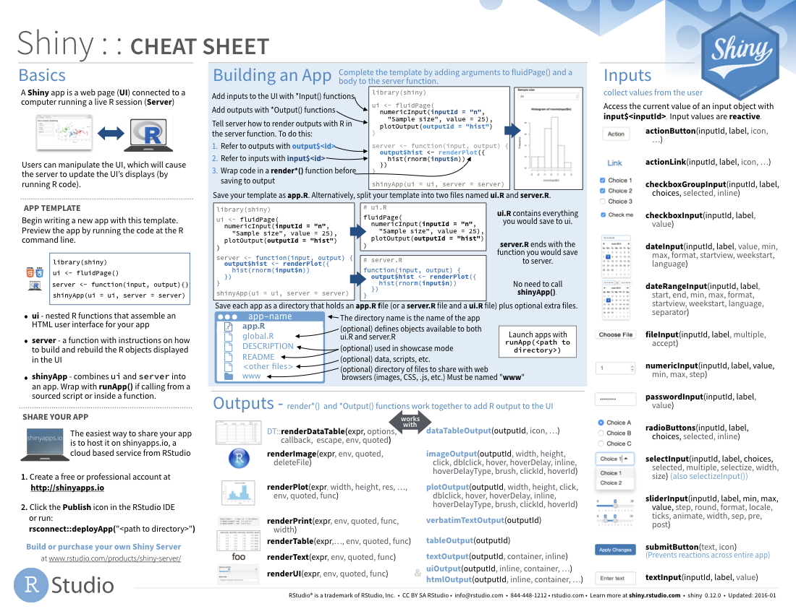

*This content was presented to Nelson\\Nygaard Staff for the Shiny Webinar series on Wednesday, October 7th, 2020, and is [available as a recording here](https://web.microsoftstream.com/video/a0ef1f1d-fec8-47c9-b7da-17466d82e21a) and is embedded below.*

<p align="center"><iframe width="640" height="360" src="https://web.microsoftstream.com/video/a0ef1f1d-fec8-47c9-b7da-17466d82e21a?autoplay=false&amp;showinfo=true" allowfullscreen style="border:none;"></iframe></p>

# Introduction

Over the past eight weeks or so, participants in the Shiny training have been experimenting with Shiny on their own, and in most cases have completed an application to present. For those who were not able to finish the application on the timeline of the training, they are discussing the application they had planned to develop and what R/Shiny tools/functions they would use to complete the application. The hope for this session  is that everyone learns a bit from each other and can share the code they developed. Following this session, Bryan will request a link the code repository (either on Sharepoint or on GitHub, as applicable) so the code can be shared with the other course participants (TODO). 

# Demo Applications

Below are descriptions and links for the demo applications developed. This data is drawn from this [Google Sheet](https://docs.google.com/spreadsheets/d/13299ksP-588xCqw-Bu0RO7IDk9gFEfoKvcbAgZNlTcg/edit?usp=sharing). This sheet contains some additional information about hours estimates and challenges encountered in developing the application. 

```{r, echo=FALSE,warning=FALSE,message=FALSE}
library(tidyverse)
library(googledrive)
library(googlesheets4)
library(DT)

demo_apps = as_id('https://docs.google.com/spreadsheets/d/13299ksP-588xCqw-Bu0RO7IDk9gFEfoKvcbAgZNlTcg/edit#gid=0') %>%
  sheets_read() 

demo_app_tbl = demo_apps %>%
  select(`First Name`,`Last Name`,
         `Completed?`,
         `Proposed Description`,`Final Description for Website`,
         `Web Link`) %>%
  mutate(`App Description` = ifelse(`Completed?`==TRUE,`Final Description for Website`,
                                    `Proposed Description`)) %>%
  select(-`Proposed Description`,-`Final Description for Website`) %>%
  select(`First Name`,`Last Name`,
         `Completed?`,`App Description`,`Web Link`) %>%
  mutate(`Web Link` = ifelse(`Completed?`==TRUE,
                                paste0("<a href='",`Web Link`,"'>",'App Link',"</a>"),
                                NA)) %>%
  mutate(`Completed?` = ifelse(`Completed?`==TRUE,'Yes','No'))

datatable(demo_app_tbl,
          rownames=FALSE, escape=FALSE,
          options = list(searching=FALSE,paging=FALSE,info=FALSE,
                         autoWidth=TRUE,
                         columnDefs = list(list(width = '100px', targets = c(4)))),
          width='100%')

```

# Conclusion

This is the end of Nelson\\Nygaard's first Shiny training! We hope to be able to do more in the future. Stay tuned for future training opportunities. 

# Reference Materials

## Cheat Sheets

RStudio's Shiny cheat sheet is a great resource to have by your side whenever developing Shiny apps. 

[](https://github.com/rstudio/cheatsheets/raw/master/shiny.pdf)

## Related DataCamp Courses

- [Shiny Fundamentals course track (4 courses, 16 hours)](https://www.datacamp.com/tracks/shiny-fundamentals-with-r)

*This content was presented to Nelson\\Nygaard Staff for the Shiny Webinar series on Wednesday, October 7th, 2020, and is [available as a recording here](https://web.microsoftstream.com/video/a0ef1f1d-fec8-47c9-b7da-17466d82e21a) and embedded at the top of the page.*