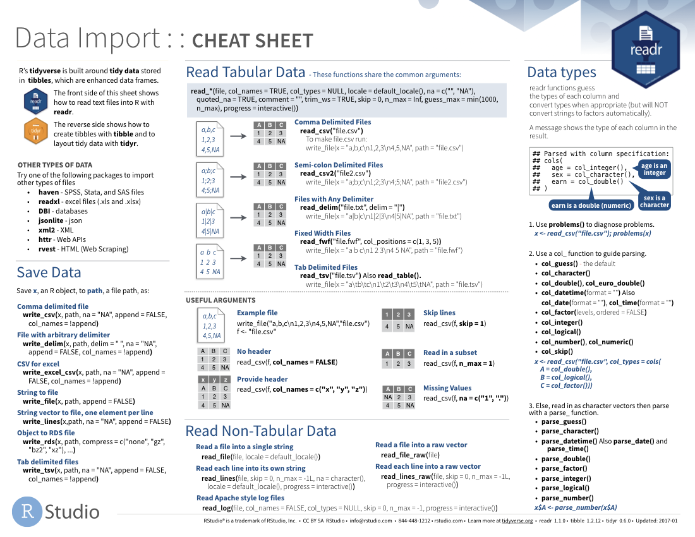
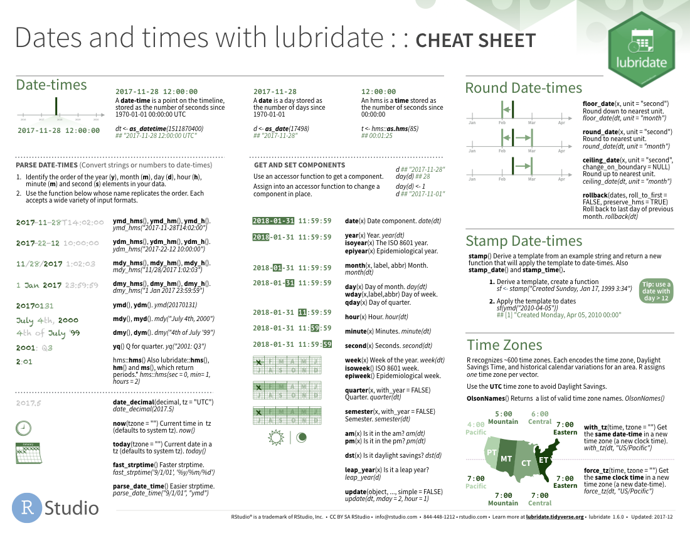

*This content was presented to Nelson\\Nygaard Staff at a Lunch and Learn webinar on Friday, August 21st, 2020, and is [available as a recording here](https://web.microsoftstream.com/video/33fc95ba-c50e-4ac0-b9e4-118217352133) and embedded below*

<p align="center"><iframe width="640" height="360" src="https://web.microsoftstream.com/embed/video/33fc95ba-c50e-4ac0-b9e4-118217352133?autoplay=false&amp;showinfo=true" allowfullscreen style="border:none;"></iframe></p>

## Introduction

The [Tidyverse](https://www.tidyverse.org/) is a 'universe' of packages designed for data science with R. They are all built with an underlying design philosophy and grammar based on the [concept of 'tidy' data](https://vita.had.co.nz/papers/tidy-data.pdf). This session will discuss the tidy data concept and its main package implementations. For me, the tidy data concept influences not just the work I do in R but how I structure spreadsheets and datasets in general, and I have found it to generally result in cleaner data analyses.[Tidyverse packages](https://www.tidyverse.org/packages/) are among the most widely used R packages, and greatly improve upon implementations of basic operations in base R. 

__Acknowledgement:__ This module heavily draws upon Hadley Wickham's (the progenitor of the Tidyverse) book (available for free online), [R for Data Science](https://r4ds.had.co.nz/), including text, pictures, and code directly copied from that book and slightly modified to suit a shorter narrative. Printed copies are available generally wherever you get your books. It is recommended that you read this book for a deeper understanding of the topics contained hereien -- only basic concepts are able to be covered within the time available. 

## A Note on Packages

For those that don't remember what packages are in R -- packages are collections of functions developed with a specific purpose in mind; typically a particular topic, data analysis method, or type of data is the focus of a package. Packages include the functions that comprise them as well as documentation, sample datasets for examples, and 'vignettes', which are example implementations of the code interspersed with narrative. Depending on how well the package has been documented, there may be more or less of these supplementary items. The most useful packages in R are typically those that are well documented. 

There are thousands of R packages, and because of the open source nature of R, anyone can develop a package and post it online. The two main places to get packages are CRAN (Comprehensive R Archive Network) and GitHub. For packages to be uploaded to CRAN, they must meet a minimum standard of documentation and unit testing of code, to ensure some minimum quality of the packages. Packages on GitHub have no standard -- they are hosted by individuals. That said, there is information in the GitHub READMEs about how well the code has been unit tested, and packages are typically only hosted on GitHub in the development phase. If you want the most 'bleeding edge' version of a package (maybe some new features in development are really helpful!), go to GitHub, but if you want the most stable version, go to CRAN. 

A helpful place to start if you have a goal in mind for your R code but you don't know which packages can help is the [CRAN Task View Page](https://cran.r-project.org/web/views/). It is a well maintained list of package topics, including some narrative description of what packages do what within each topic. For example, we might want to check out the [Spatial task view](https://cran.r-project.org/web/views/Spatial.html). There we can see the many packages developed with spatial analysis in mind. 

Another place to go is Google 🤓 -- there is a widespread (and well documented) R community on GitHub, StackOverflow, and various R blogs that can help put you on the right path. Chances are someone has had the same question as you (typically many someones), and if they haven't, then you might have a package to develop on your hands...

## Tidyverse Packages

As mentioned above, the Tidyverse consists of a collection of R packages -- several of the key packages are highlighted below. 

* [ggplot2](https://ggplot2.tidyverse.org), for data visualisation.
* [dplyr](https://dplyr.tidyverse.org), for data manipulation.
* [tidyr](https://tidyr.tidyverse.org), for data tidying.
* [readr](https://readr.tidyverse.org), for data import.
* [purrr](https://purrr.tidyverse.org), for functional programming.
* [tibble](https://tibble.tidyverse.org), for tibbles, a modern re-imagining of data frames.
* [stringr](https://github.com/tidyverse/stringr), for character strings.
* [forcats](https://github.com/hadley/forcats), for factors.

Conveniently, Hadley and RStudio created a [`tidyverse`](https://tidyverse.tidyverse.org/) package, which with a single installation command (`install.packages(tidyverse)`) will install the above packages, and with a single library command (`library(tidyverse)`) will load those packages into your environment. 

You also get a condensed summary of conflicts with other packages you have loaded:

```{r example, warning=FALSE}
library(tidyverse)
```

You can see conflicts created later with `tidyverse_conflicts()`:

```{r conflicts}
library(MASS)
tidyverse_conflicts()
detach("package:MASS", unload=TRUE)
```

As well as the core tidyverse, installing this package also installs a selection of other packages that you're likely to use frequently, but probably not in every analysis. This means they are installed, but not loaded by defaault, so if you want to use them you will need to load them with a `library()` call. This includes packages for:

*   Working with specific types of vectors:

    * [hms](https://github.com/rstats-db/hms), for times.
    * [lubridate](https://github.com/tidyverse/lubridate), for date/times.
    
*   Importing other types of data:

    * [feather](https://github.com/wesm/feather), for sharing with Python and other languages.
    * [haven](https://github.com/tidyverse/haven), for SPSS, SAS and Stata files.
    * [httr](https://github.com/r-lib/httr), for web apis.
    * [jsonlite](https://github.com/jeroen/jsonlite) for JSON.
    * [readxl](https://github.com/tidyverse/readxl), for `.xls` and `.xlsx` files.
    * [rvest](https://github.com/tidyverse/rvest), for web scraping.
    * [xml2](https://github.com/r-lib/xml2), for XML.

*   Modeling

    * [modelr](https://github.com/tidyverse/modelr), for modelling within a pipeline
    * [broom](https://github.com/tidymodels/broom), for turning models into 
      tidy data

And you can check that all tidyverse packages are up-to-date with `tidyverse_update()`:

```{r update, eval = FALSE}
tidyverse_update()
#> The following packages are out of date:
#>  * broom (0.4.0 -> 0.4.1)
#>  * DBI   (0.4.1 -> 0.5)
#>  * Rcpp  (0.12.6 -> 0.12.7)
#> Update now?
#> 
#> 1: Yes
#> 2: No
```

## The Key Parts of the Tidyverse Model of Data Science

Hadley proposes a model that nearly all data science projects approximate, described by the below illustration. This course module will mostly focus upon three of these concepts -- tidying, transforming, and visualizing. The other topics will be touched on in other course modules. A deeper dive is needed on all these topics for a well rounded data science professional, and it is again recommended to refer to [R for Data Science](https://r4ds.had.co.nz/). 

```{r echo = FALSE, out.width = "75%", fig.align='center'}
knitr::include_graphics("graphics/diagrams/data-science.png")
```

## Tidy Data

### What is Tidy Data?

You can represent the same underlying data in multiple ways. The example below shows the same data organised in four different ways. Each dataset shows the same values of four variables *country*, *year*, *population*, and *cases*, but each dataset organises the values in a different way.

```{r}
table1
table2
table3

# Spread across two tibbles
table4a  # cases
table4b  # population
```

These are all representations of the same underlying data, but they are not equally easy to use. One dataset, the tidy dataset, will be much easier to work with inside the tidyverse. 

There are three interrelated rules which make a dataset tidy:

1.  Each variable must have its own column.
1.  Each observation must have its own row.
1.  Each value must have its own cell.

The below illustration shows the rules visually: "Following three rules makes a dataset tidy: variables are in columns, observations are in rows, and values are in cells.

```{r tidy-structure, echo = FALSE, out.width = "100%"}
knitr::include_graphics("graphics/images/tidy-1.png")
```

These three rules are interrelated because it's impossible to only satisfy two of the three. That interrelationship leads to an even simpler set of practical instructions:

1.  Put each dataset in a tibble.
1.  Put each variable in a column.

In this example, only `table1` is tidy. It's the only representation where each column is a variable.

Why ensure that your data is tidy? There are two main advantages:

1.  There's a general advantage to picking one consistent way of storing
    data. If you have a consistent data structure, it's easier to learn the
    tools that work with it because they have an underlying uniformity.
    
1.  There's a specific advantage to placing variables in columns because
    it allows R's vectorised nature to shine. Most 
    built-in R functions work with vectors of values. That makes transforming 
    tidy data feel particularly natural.

`dplyr`, `ggplot2`, and all the other packages in the tidyverse are designed to work with tidy data.

### Tidying

#### Pivoting

The principles of tidy data seem so obvious that you might wonder if you'll ever encounter a dataset that isn't tidy. Unfortunately, however, most data that you will encounter will be untidy. There are two main reasons:

1.  Most people aren't familiar with the principles of tidy data, and it's hard
    to derive them yourself unless you spend a _lot_ of time working with data.
    
1.  Data is often organized to facilitate some use other than analysis. For 
    example, data is often organized to make entry as easy as possible.
    
This means for most real analyses, you'll need to do some tidying. The first step is always to figure out what the variables and observations are. Sometimes this is easy; other times you'll need to consult with the people who originally generated the data. 
The second step is to resolve one of two common problems:

1. One variable might be spread across multiple columns.

1. One observation might be scattered across multiple rows.

Typically a dataset will only suffer from one of these problems; it'll only suffer from both if you're really unlucky! To fix these problems, you'll need the two most important functions in tidyr: `pivot_longer()` and `pivot_wider()`.


#### Separating and uniting

So far you've learned how to tidy `table2` and `table4`, but not `table3`. `table3` has a different problem: we have one column (`rate`) that contains two variables (`cases` and `population`). To fix this problem, we'll need the `separate()` function. You'll also learn about the complement of `separate()`: `unite()`, which you use if a single variable is spread across multiple columns.

##### Separate

`separate()` pulls apart one column into multiple columns, by splitting wherever a separator character appears. Take `table3`:

```{r}
table3
```

The `rate` column contains both `cases` and `population` variables, and we need to split it into two variables. `separate()` takes the name of the column to separate, and the names of the columns to separate into, as shown in Figure \@ref(fig:tidy-separate) and the code below.

```{r}
table3 %>% 
  separate(rate, into = c("cases", "population"))
```

```{r tidy-separate, echo = FALSE, out.width = "75%", fig.cap = "Separating `table3` makes it tidy"}
knitr::include_graphics("graphics/images/tidy-17.png")
```

By default, `separate()` will split values wherever it sees a non-alphanumeric character (i.e. a character that isn't a number or letter). For example, in the code above, `separate()` split the values of `rate` at the forward slash characters. If you wish to use a specific character to separate a column, you can pass the character to the `sep` argument of `separate()`. For example, we could rewrite the code above as:

```{r eval = FALSE}
table3 %>% 
  separate(rate, into = c("cases", "population"), sep = "/")
```

(Formally, `sep` is a regular expression, which you'll learn more about in [strings].)

Look carefully at the column types: you'll notice that `cases` and `population` are character columns. This is the default behaviour in `separate()`: it leaves the type of the column as is. Here, however, it's not very useful as those really are numbers. We can ask `separate()` to try and convert to better types using `convert = TRUE`:

```{r}
table3 %>% 
  separate(rate, into = c("cases", "population"), convert = TRUE)
```

You can also pass a vector of integers to `sep`. `separate()` will interpret the integers as positions to split at. Positive values start at 1 on the far-left of the strings; negative value start at -1 on the far-right of the strings. When using integers to separate strings, the length of `sep` should be one less than the number of names in `into`. 

You can use this arrangement to separate the last two digits of each year. This make this data less tidy, but is useful in other cases, as you'll see in a little bit.

```{r}
table3 %>% 
  separate(year, into = c("century", "year"), sep = 2)
```

##### Unite

`unite()` is the inverse of `separate()`: it combines multiple columns into a single column. You'll need it much less frequently than `separate()`, but it's still a useful tool to have in your back pocket.

```{r tidy-unite, echo = FALSE, out.width = "75%", fig.cap = "Uniting `table5` makes it tidy"}
knitr::include_graphics("graphics/images/tidy-18.png")
```

We can use `unite()` to rejoin the *century* and *year* columns that we created in the last example. That data is saved as `tidyr::table5`. `unite()` takes a data frame, the name of the new variable to create, and a set of columns to combine, again specified in `dplyr::select()` style:

```{r}
table5 %>% 
  unite(new, century, year)
```

In this case we also need to use the `sep` argument. The default will place an underscore (`_`) between the values from different columns. Here we don't want any separator so we use `""`:

```{r}
table5 %>% 
  unite(new, century, year, sep = "")
```

#### Cheat Sheet

A handy sheet to have on hand is RStudio's [Data Import Cheat Sheet](https://github.com/rstudio/cheatsheets/raw/master/data-import.pdf) -- this will give you a high level overview of the functions for both reading in data and then tidying. Note that this cheat sheet has not yet been updated with the switch to `pivot_*` functions from `gather()` and `spread()`, but I would expect an update soon. 

[](https://github.com/rstudio/cheatsheets/raw/master/data-import.pdf)

### Transforming

#### General

Before we start an example, a note about **transforming**, to get us back to the Data Science framework we referred to above. Typically, after you tidy your data, there will be value in additional columns that you add to that data by transforming it in some way - generally these are added using the `mutate()` function. This can be as simple as extracting the **year** value from your **date** column, or something more complex, like assigning a geographic zone to a record (we will do this in the geospatial data module). Transforming is part of your script that adds value after your data has typically already been tidied but before it is used for visuzalation or modeling. We will do some transformations in the below example. 

Again, RStudio has a handy [cheat sheet for data transformation](https://github.com/rstudio/cheatsheets/raw/master/data-transformation.pdf), which might be especially useful to you since we did not cover that topic in depth here. 

[](https://github.com/rstudio/cheatsheets/raw/master/data-transformation.pdf)

#### Dates and Times

A key part of the transformations we are doing below has to do with working with date and time data in R, which can have a learning curve -- it is recommended to look at this cheat sheet, and for further learning to take a DataCamp course referenced at the bottom of this page. As with anything in R, the best way to learn is by doing. 

[](https://github.com/rstudio/cheatsheets/raw/master/lubridate.pdf)

### Example: Part A

In submitting your interest for R training, you all generated some data that could use some tidying -- let's take a look at your Doodle responses below.  

Some notes on the below code block:

- **The Pipe:** If you are not familiar with the `%>%` operator (known as 'the pipe operator'), meet your new best friend! It comes from the `magrittr` R package (part of the tidyverse) and gets rid of the need to nest multiple parentheses. Pass the result of one function directly into the first argument of the next. 
- **A note on `pivot_*` functions:**  I (Bryan) did not realize prior to developing this course that `gather()` and `spread()` were no longer the preferred way of converting between longer and wider data formats, so I am learning this new preferred implementation along with you! Instead of `gather()`, we should be using `pivot_longer()`, and instead of `spread()` we should be using `pivot_wider()`. The old functions still work but they are no longer being actively improved. If the old functions mean nothing to you, then don't worry about this note! 
- **There are many ways to do this:** going from messy data to tidy data is not a straight line. You can use the functions below in a different order (or use different functions!) that can take more or less lines of code -- do this in the way that best makes sense to you and still gives you the result you want. Experiment using different lines to get to the same result!

```{r, message=FALSE, warning=FALSE}
library(tidyverse) #Loading the tidyverse
library(readxl) #For reading Excel files
library(janitor) #For cleaning up column names
library(forcats) #For implementing ordered categorical 
library(hms) #For working with times of day

raw_doodle = read_excel('data/r_doodle.xls')

#Take a look at data in R studio viewer and in Excel. 
#Column names are weird, the information we want is several rows down from the top. 
#Luckily we can use skip some rows and rename columns to make them easier to manipulate

raw_doodle

#Let's try to fix a few things at first
less_raw_doodle = read_excel('data/r_doodle.xls',skip = 3) %>% #Skipping three rows, we will need both weekday and time data from top two new rows
  clean_names() %>%#Cleaning names to make them easier to use, R likes names that don't have spaces, special characters, or leading numbers. 
  rename(x2 = august_2020, # We don't need to know that it is August 2020
         name = x1) #Name is going to be our primary identifier 
  
#Take a look at the newly read in dataset
less_raw_doodle

#We're going to break this data down into a couple of parts and join it back together 

#Time preferences
time_prefs = less_raw_doodle %>% 
  filter(!is.na(name)) %>% #Get only the rows with people's time preferences indicated
  pivot_longer(cols = starts_with('x'), #All columns except name
               names_to = 'key', #Old convention from gather
               values_to='value') #Old convention from gather

#Time block definitions
time_blocks = less_raw_doodle %>%
  slice(1:2) %>% #Extract first two rows
  select(-name) %>% #Do not need name column here
  pivot_longer(cols = everything(), #All columns
               names_to = 'key',
               values_to = 'value') %>%
  fill(value,.direction = 'down') %>%
  mutate(col_type = ifelse(str_detect(value,':'),'time','date')) %>%
  pivot_wider(id_cols = key,
              names_from=col_type,
              values_from=value)

#Join the split dataset back together
time_prefs_joined = time_prefs %>%
  left_join(time_blocks,by='key') %>%
  select(-key) %>% #Do not need this anymore
  filter(name!='Count') %>%
  mutate(value = case_when(
    value=='OK'~'Yes',
    value=='(OK)'~'Maybe',
    TRUE~'No'
  ),
  value = factor(value,ordered=TRUE,levels = c('Yes','Maybe','No')),
  weekday = str_sub(date,1,3),
  weekday = factor(weekday,ordered=TRUE,levels = c('Mon','Tue','Wed','Thu','Fri'))) %>%
  separate(time,into=c('from_time','to_time'),sep=' – ') %>%
  mutate(from_time = strptime(from_time,format='%I:%M %p') %>%
           as.hms(),
         to_time = strptime(to_time,format='%I:%M %p') %>%
           as.hms()) %>%
  select(-date) %>%
  #this block uses the map() function from purrr, which we will discuss later in the module
  mutate(
    first_name = map_chr(name,function(name){
    (name %>%
      str_split(' ') %>%
      unlist())[1]}),
    last_name = map_chr(name,function(name){
    (name %>%
      str_split(' ') %>%
      unlist())[2]})
  ) %>%
  arrange(desc(last_name),desc(first_name),
          weekday,from_time,to_time) %>%
  mutate(name_factor = factor(name,ordered=TRUE,levels = unique(name)))

#Look how tidy this data is!!! This will make plotting much easier in next steps
time_prefs_joined

```

### Visualizing

This section will focus on visualizing your data using ggplot2. R has several systems for making graphs, but ggplot2 is one of the most elegant and most versatile. ggplot2 implements the __grammar of graphics__, a coherent system for describing and building graphs. With ggplot2, you can do more faster by learning one system and applying it in many places.

If you'd like to learn more about the theoretical underpinnings of ggplot2 before you start, I'd recommend reading "The Layered Grammar of Graphics", <http://vita.had.co.nz/papers/layered-grammar.pdf>.

#### First steps

Let's use our first graph to answer a question: Do cars with big engines use more fuel than cars with small engines? You probably already have an answer, but try to make your answer precise. What does the relationship between engine size and fuel efficiency look like? Is it positive? Negative? Linear? Nonlinear?

##### The `mpg` data frame

You can test your answer with the `mpg` __data frame__ found in ggplot2 (aka  `ggplot2::mpg`). A data frame is a rectangular collection of variables (in the columns) and observations (in the rows). `mpg` contains observations collected by the US Environmental Protection Agency on 38 models of car. 

```{r}
mpg
```

Among the variables in `mpg` are:

1. `displ`, a car's engine size, in litres.

1. `hwy`, a car's fuel efficiency on the highway, in miles per gallon (mpg). 
  A car with a low fuel efficiency consumes more fuel than a car with a high 
  fuel efficiency when they travel the same distance. 

To learn more about `mpg`, open its help page by running `?mpg`.

##### Creating a ggplot

To plot `mpg`, run this code to put `displ` on the x-axis and `hwy` on the y-axis:

```{r}
ggplot(data = mpg) + 
  geom_point(mapping = aes(x = displ, y = hwy))
```

The plot shows a negative relationship between engine size (`displ`) and fuel efficiency (`hwy`). In other words, cars with big engines use more fuel. Does this confirm or refute your hypothesis about fuel efficiency and engine size?

With ggplot2, you begin a plot with the function `ggplot()`. `ggplot()` creates a coordinate system that you can add layers to. The first argument of `ggplot()` is the dataset to use in the graph. So `ggplot(data = mpg)` creates an empty graph, but it's not very interesting so I'm not going to show it here.

You complete your graph by adding one or more layers to `ggplot()`. The function `geom_point()` adds a layer of points to your plot, which creates a scatterplot. ggplot2 comes with many geom functions that each add a different type of layer to a plot. You'll learn a whole bunch of them throughout this chapter.

Each geom function in ggplot2 takes a `mapping` argument. This defines how variables in your dataset are mapped to visual properties. The `mapping` argument is always paired with `aes()`, and the `x` and `y` arguments of `aes()` specify which variables to map to the x and y axes. ggplot2 looks for the mapped variables in the `data` argument, in this case, `mpg`.

##### A graphing template

Let's turn this code into a reusable template for making graphs with ggplot2. To make a graph, replace the bracketed sections in the code below with a dataset, a geom function, or a collection of mappings.

```{r eval = FALSE}
ggplot(data = <DATA>) + 
  <GEOM_FUNCTION>(mapping = aes(<MAPPINGS>))
```

The rest of this guide will show you how to complete and extend this template to make different types of graphs. We will begin with the `<MAPPINGS>` component.

#### Aesthetic mappings

In the plot below, one group of points (highlighted in red) seems to fall outside of the linear trend. These cars have a higher mileage than you might expect. How can you explain these cars? 

```{r, echo = FALSE}
ggplot(data = mpg, mapping = aes(x = displ, y = hwy)) +
  geom_point() + 
  geom_point(data = dplyr::filter(mpg, displ > 5, hwy > 20), colour = "red", size = 2.2)
```

Let's hypothesize that the cars are hybrids. One way to test this hypothesis is to look at the `class` value for each car. The `class` variable of the `mpg` dataset classifies cars into groups such as compact, midsize, and SUV. If the outlying points are hybrids, they should be classified as compact cars or, perhaps, subcompact cars (keep in mind that this data was collected before hybrid trucks and SUVs became popular).

You can add a third variable, like `class`, to a two dimensional scatterplot by mapping it to an __aesthetic__. An aesthetic is a visual property of the objects in your plot. Aesthetics include things like the size, the shape, or the color of your points. You can display a point (like the one below) in different ways by changing the values of its aesthetic properties. Since we already use the word "value" to describe data, let's use the word "level" to describe aesthetic properties. Here we change the levels of a point's size, shape, and color to make the point small, triangular, or blue:

```{r, echo = FALSE, asp = 1/4}
ggplot() +
  geom_point(aes(1, 1), size = 20) +
  geom_point(aes(2, 1), size = 10) + 
  geom_point(aes(3, 1), size = 20, shape = 17) + 
  geom_point(aes(4, 1), size = 20, colour = "blue") + 
  scale_x_continuous(NULL, limits = c(0.5, 4.5), labels = NULL) + 
  scale_y_continuous(NULL, limits = c(0.9, 1.1), labels = NULL) + 
  theme(aspect.ratio = 1/3)
```

You can convey information about your data by mapping the aesthetics in your plot to the variables in your dataset. For example, you can map the colors of your points to the `class` variable to reveal the class of each car.

```{r}
ggplot(data = mpg) + 
  geom_point(mapping = aes(x = displ, y = hwy, color = class))
```

To map an aesthetic to a variable, associate the name of the aesthetic to the name of the variable inside `aes()`. ggplot2 will automatically assign a unique level of the aesthetic (here a unique color) to each unique value of the variable, a process known as __scaling__. ggplot2 will also add a legend that explains which levels correspond to which values.

The colors reveal that many of the unusual points are two-seater cars. These cars don't seem like hybrids, and are, in fact, sports cars! Sports cars have large engines like SUVs and pickup trucks, but small bodies like midsize and compact cars, which improves their gas mileage. In hindsight, these cars were unlikely to be hybrids since they have large engines.

In the above example, we mapped `class` to the color aesthetic, but we could have mapped `class` to the size aesthetic in the same way. In this case, the exact size of each point would reveal its class affiliation. We get a _warning_ here, because mapping an unordered variable (`class`) to an ordered aesthetic (`size`) is not a good idea.

```{r}
ggplot(data = mpg) + 
  geom_point(mapping = aes(x = displ, y = hwy, size = class))
```

Or we could have mapped `class` to the _alpha_ aesthetic, which controls the transparency of the points, or to the shape aesthetic, which controls the shape of the points.

```{r out.width = "50%", fig.align = 'default', warning = FALSE, fig.asp = 1/2, fig.cap =""}
# Left
ggplot(data = mpg) + 
  geom_point(mapping = aes(x = displ, y = hwy, alpha = class))

# Right
ggplot(data = mpg) + 
  geom_point(mapping = aes(x = displ, y = hwy, shape = class))
```

What happened to the SUVs? ggplot2 will only use six shapes at a time. By default, additional groups will go unplotted when you use the shape aesthetic.

For each aesthetic, you use `aes()` to associate the name of the aesthetic with a variable to display. The `aes()` function gathers together each of the aesthetic mappings used by a layer and passes them to the layer's mapping argument. The syntax highlights a useful insight about `x` and `y`: the x and y locations of a point are themselves aesthetics, visual properties that you can map to variables to display information about the data. 

Once you map an aesthetic, ggplot2 takes care of the rest. It selects a reasonable scale to use with the aesthetic, and it constructs a legend that explains the mapping between levels and values. For x and y aesthetics, ggplot2 does not create a legend, but it creates an axis line with tick marks and a label. The axis line acts as a legend; it explains the mapping between locations and values.

You can also _set_ the aesthetic properties of your geom manually. For example, we can make all of the points in our plot blue:

```{r}
ggplot(data = mpg) + 
  geom_point(mapping = aes(x = displ, y = hwy), color = "blue")
```

Here, the color doesn't convey information about a variable, but only changes the appearance of the plot. To set an aesthetic manually, set the aesthetic by name as an argument of your geom function; i.e. it goes _outside_ of `aes()`. You'll need to pick a level that makes sense for that aesthetic:

* The name of a color as a character string.

* The size of a point in mm.

* The shape of a point as a number, as shown below. 

```{r shapes, echo = FALSE, out.width = "75%", fig.asp = 1/3, warning = FALSE}
shapes <- tibble(
  shape = c(0, 1, 2, 5, 3, 4, 6:19, 22, 21, 24, 23, 20),
  x = (0:24 %/% 5) / 2,
  y = (-(0:24 %% 5)) / 4
)
ggplot(shapes, aes(x, y)) + 
  geom_point(aes(shape = shape), size = 5, fill = "red") +
  geom_text(aes(label = shape), hjust = 0, nudge_x = 0.15) +
  scale_shape_identity() +
  expand_limits(x = 4.1) +
  scale_x_continuous(NULL, breaks = NULL) + 
  scale_y_continuous(NULL, breaks = NULL, limits = c(-1.2, 0.2)) + 
  theme_minimal() +
  theme(aspect.ratio = 1/2.75)
```

#### Facets

One way to add additional variables is with aesthetics. Another way, particularly useful for categorical variables, is to split your plot into __facets__, subplots that each display one subset of the data. 

To facet your plot by a single variable, use `facet_wrap()`. The first argument of `facet_wrap()` should be a formula, which you create with `~` followed by a variable name (here "formula" is the name of a data structure in R, not a synonym for "equation"). The variable that you pass to `facet_wrap()` should be discrete. 

```{r}
ggplot(data = mpg) + 
  geom_point(mapping = aes(x = displ, y = hwy)) + 
  facet_wrap(~ class, nrow = 2)
```

To facet your plot on the combination of two variables, add `facet_grid()` to your plot call. The first argument of `facet_grid()` is also a formula. This time the formula should contain two variable names separated by a `~`. 

```{r}
ggplot(data = mpg) + 
  geom_point(mapping = aes(x = displ, y = hwy)) + 
  facet_grid(drv ~ cyl)
```

If you prefer to not facet in the rows or columns dimension, use a `.` instead of a variable name, e.g. `+ facet_grid(. ~ cyl)`.

#### Geometric objects

How are these two plots similar? 

```{r echo = FALSE, out.width = "50%", fig.align="default", message = FALSE}
ggplot(data = mpg) + 
  geom_point(mapping = aes(x = displ, y = hwy))

ggplot(data = mpg) + 
  geom_smooth(mapping = aes(x = displ, y = hwy))
```

Both plots contain the same x variable, the same y variable, and both describe the same data. But the plots are not identical. Each plot uses a different visual object to represent the data. In ggplot2 syntax, we say that they use different __geoms__.

A __geom__ is the geometrical object that a plot uses to represent data. People often describe plots by the type of geom that the plot uses. For example, bar charts use bar geoms, line charts use line geoms, boxplots use boxplot geoms, and so on. Scatterplots break the trend; they use the point geom. As we see above, you can use different geoms to plot the same data. The plot on the left uses the point geom, and the plot on the right uses the smooth geom, a smooth line fitted to the data. 

To change the geom in your plot, change the geom function that you add to `ggplot()`. For instance, to make the plots above, you can use this code:

```{r eval = FALSE}
# left
ggplot(data = mpg) + 
  geom_point(mapping = aes(x = displ, y = hwy))

# right
ggplot(data = mpg) + 
  geom_smooth(mapping = aes(x = displ, y = hwy))
```

Every geom function in ggplot2 takes a `mapping` argument. However, not every aesthetic works with every geom. You could set the shape of a point, but you couldn't set the "shape" of a line. On the other hand, you _could_ set the linetype of a line. `geom_smooth()` will draw a different line, with a different linetype, for each unique value of the variable that you map to linetype.

```{r message = FALSE}
ggplot(data = mpg) + 
  geom_smooth(mapping = aes(x = displ, y = hwy, linetype = drv))
```

Here `geom_smooth()` separates the cars into three lines based on their `drv` value, which describes a car's drivetrain. One line describes all of the points with a `4` value, one line describes all of the points with an `f` value, and one line describes all of the points with an `r` value. Here, `4` stands for four-wheel drive, `f` for front-wheel drive, and `r` for rear-wheel drive.

If this sounds strange, we can make it more clear by overlaying the lines on top of the raw data and then coloring everything according to `drv`. 

```{r echo = FALSE, message = FALSE}
ggplot(data = mpg, mapping = aes(x = displ, y = hwy, color = drv)) + 
  geom_point() +
  geom_smooth(mapping = aes(linetype = drv))
```

Notice that this plot contains two geoms in the same graph! If this makes you excited, buckle up. We will learn how to place multiple geoms in the same plot very soon.

ggplot2 provides over 40 geoms, and extension packages provide even more (see <https://exts.ggplot2.tidyverse.org/gallery/> for a sampling). The best way to get a comprehensive overview is the ggplot2 cheatsheet, which you can find at <http://rstudio.com/cheatsheets>. To learn more about any single geom, use help: `?geom_smooth`.

Many geoms, like `geom_smooth()`, use a single geometric object to display multiple rows of data. For these geoms, you can set the `group` aesthetic to a categorical variable to draw multiple objects. ggplot2 will draw a separate object for each unique value of the grouping variable. In practice, ggplot2 will automatically group the data for these geoms whenever you map an aesthetic to a discrete variable (as in the `linetype` example). It is convenient to rely on this feature because the group aesthetic by itself does not add a legend or distinguishing features to the geoms.

```{r, fig.width = 3, fig.align = 'default', out.width = "33%", message = FALSE}
ggplot(data = mpg) +
  geom_smooth(mapping = aes(x = displ, y = hwy))
              
ggplot(data = mpg) +
  geom_smooth(mapping = aes(x = displ, y = hwy, group = drv))
    
ggplot(data = mpg) +
  geom_smooth(
    mapping = aes(x = displ, y = hwy, color = drv),
    show.legend = FALSE
  )
```

To display multiple geoms in the same plot, add multiple geom functions to `ggplot()`:

```{r, message = FALSE}
ggplot(data = mpg) + 
  geom_point(mapping = aes(x = displ, y = hwy)) +
  geom_smooth(mapping = aes(x = displ, y = hwy))
```

This, however, introduces some duplication in our code. Imagine if you wanted to change the y-axis to display `cty` instead of `hwy`. You'd need to change the variable in two places, and you might forget to update one. You can avoid this type of repetition by passing a set of mappings to `ggplot()`. ggplot2 will treat these mappings as global mappings that apply to each geom in the graph.  In other words, this code will produce the same plot as the previous code:

```{r, eval = FALSE}
ggplot(data = mpg, mapping = aes(x = displ, y = hwy)) + 
  geom_point() + 
  geom_smooth()
```

If you place mappings in a geom function, ggplot2 will treat them as local mappings for the layer. It will use these mappings to extend or overwrite the global mappings _for that layer only_. This makes it possible to display different aesthetics in different layers.

```{r, message = FALSE}
ggplot(data = mpg, mapping = aes(x = displ, y = hwy)) + 
  geom_point(mapping = aes(color = class)) + 
  geom_smooth()
```

You can use the same idea to specify different `data` for each layer. Here, our smooth line displays just a subset of the `mpg` dataset, the subcompact cars. The local data argument in `geom_smooth()` overrides the global data argument in `ggplot()` for that layer only.

```{r, message = FALSE}
ggplot(data = mpg, mapping = aes(x = displ, y = hwy)) + 
  geom_point(mapping = aes(color = class)) + 
  geom_smooth(data = filter(mpg, class == "subcompact"), se = FALSE)
```

#### Cheat Sheet

As with the other sections, until you've spent a lot of time using the language (and even when you have!) it is hard to remember all the names of functions used and their parameters and syntaxes. Cheat sheets are helpful to have around!

[](https://github.com/rstudio/cheatsheets/raw/master/data-visualization-2.1.pdf)

### Example: Part B

Below, we're going to take the data we tidied in Part A and make a plot that quickly demonstrates when people are free for R training. Below is a single ggplot code block, with many comments throughout to explain the different pieces. As discussed above, ggplot code is modular -- you can add on as many separate pieces as you want (as long as those pieces are not directly conflicting). 

```{r, message=FALSE, warning=FALSE, fig.width=40, fig.height=16, fig.retina=2}
ggplot(time_prefs_joined)+
  geom_rect(aes(
    #Translating times from hms to POSIXct to take advantage of scale_x_datetime()
    #Unfortunately there is not an hms specific scale yet
    xmin=as.POSIXct(from_time),
    xmax=as.POSIXct(to_time),
    #This is a bit of a hack, and there are multiple ways to handle this. 
    #Here I am translating the name into a number so I can create a 'width' for the rectangle. 
    #Another way to do this would be to use geom_tile()
    ymin = as.numeric(name_factor)-0.5,
    ymax = as.numeric(name_factor)+0.5,
    #The fill color of each rectangle will be determined by what a person filled in the time block in Doodle with. 
    fill = value),
    #Making the rectangles semi-transparent since they overlap
    alpha = 0.5)+
  #I want a separate subplot for each weekday
  facet_wrap(~weekday,nrow=1)+
  #Here is the other part of me using the names as ordinal factors to create a rectangle width
  scale_y_continuous(breaks = 1:length(unique(time_prefs_joined$name_factor)),
                     labels = levels(time_prefs_joined$name_factor),
                     limits = c(0.5,(length(unique(time_prefs_joined$name_factor))+0.5)))+
  ggtitle('Doodle Results for Scheduling R Trainings')+
  xlab('Time of Day (PDT)')+ylab('Participant Name')+
  # Here I am using strftime() formatting codes to simplify the time format displayed
  scale_x_datetime(date_labels = '%I %p',date_breaks = '1 hour')+
  #Rotating x axis labels to make them easier to read
  theme(axis.text.x = element_text(angle = 45, hjust=1),
        text = element_text(size=30))

```

### Purrr

The [`purrr`](https://purrr.tidyverse.org/) package has been around for several years now, but with some recent updates across the tidyverse packages, and my recent introduction via some [datacamp courses](https://learn.datacamp.com/skill-tracks/intermediate-tidyverse-toolbox?version=1), it has become a crucial part of my R programming toolbox that I would like to spend some time on. 

Iteration is a common feature of programming, and one of the main reasons people want to program in the first place -- e.g., 'I want to do this analysis **for each** sub-unit in my analysis framework'. The typical way to accomplish iteration is through loops, with the most common variety being `for` loops. For loops are an easy-to-understand way to iterate through an analysis, but they have at least three main drawbacks: 1) they are slow, and 2) a lot of extra unnecessary code is created, 3) they are not modular -- pieces of for loops have to be manually copy-pasted, rather than referencing a modular function. 

`purrr` allows for the iterative application of functions to data frames. Additionally, it allows for the nesting of data frames - sometimes we will want to isolate pieces of the iterative analysis, and rather than creating a separate data frame for each iteration, we can nest the iterations into one big data frame. 

The best overview of `purrr`'s functionality is in the [Iteration chapter of R for Data Science](https://r4ds.had.co.nz/iteration.html). Some of that chapter is copied here, but it is useful to review the entire chapter for a comprehensive understanding. 

#### For loops vs. functionals

For loops are not as important in R as they are in other languages because R is a functional programming language. This means that it's possible to wrap up for loops in a function, and call that function instead of using the for loop directly.

To see why this is important, consider (again) this simple data frame:

```{r}
df <- tibble(
  a = rnorm(10),
  b = rnorm(10),
  c = rnorm(10),
  d = rnorm(10)
)
```

Imagine you want to compute the mean of every column. You could do that with a for loop:

```{r}
output <- vector("double", length(df))
for (i in seq_along(df)) {
  output[[i]] <- mean(df[[i]])
}
output
```

You realise that you're going to want to compute the means of every column pretty frequently, so you extract it out into a function:

```{r}
col_mean <- function(df) {
  output <- vector("double", length(df))
  for (i in seq_along(df)) {
    output[i] <- mean(df[[i]])
  }
  output
}
```

But then you think it'd also be helpful to be able to compute the median, and the standard deviation, so you copy and paste your `col_mean()` function and replace the `mean()` with `median()` and `sd()`:

```{r}
col_median <- function(df) {
  output <- vector("double", length(df))
  for (i in seq_along(df)) {
    output[i] <- median(df[[i]])
  }
  output
}
col_sd <- function(df) {
  output <- vector("double", length(df))
  for (i in seq_along(df)) {
    output[i] <- sd(df[[i]])
  }
  output
}
```

Uh oh! You've copied-and-pasted this code twice, so it's time to think about how to generalise it. Notice that most of this code is for-loop boilerplate and it's hard to see the one thing (`mean()`, `median()`, `sd()`) that is different between the functions.

What would you do if you saw a set of functions like this:

```{r}
f1 <- function(x) abs(x - mean(x)) ^ 1
f2 <- function(x) abs(x - mean(x)) ^ 2
f3 <- function(x) abs(x - mean(x)) ^ 3
```

Hopefully, you'd notice that there's a lot of duplication, and extract it out into an additional argument:

```{r}
f <- function(x, i) abs(x - mean(x)) ^ i
```

You've reduced the chance of bugs (because you now have 1/3 of the original code), and made it easy to generalise to new situations. 

We can do exactly the same thing with `col_mean()`, `col_median()` and `col_sd()` by adding an argument that supplies the function to apply to each column:

```{r}
col_summary <- function(df, fun) {
  out <- vector("double", length(df))
  for (i in seq_along(df)) {
    out[i] <- fun(df[[i]])
  }
  out
}
col_summary(df, median)
col_summary(df, mean)
```

The idea of passing a function to another function is an extremely powerful idea, and it's one of the behaviours that makes R a functional programming language. It might take you a while to wrap your head around the idea, but it's worth the investment. In the rest of the chapter, you'll learn about and use the __purrr__ package, which provides functions that eliminate the need for many common for loops. The apply family of functions in base R (`apply()`, `lapply()`, `tapply()`, etc) solve a similar problem, but purrr is more consistent and thus is easier to learn.

The goal of using purrr functions instead of for loops is to allow you to break common list manipulation challenges into independent pieces: 

1. How can you solve the problem for a single element of the list? Once
   you've solved that problem, purrr takes care of generalising your
   solution to every element in the list.

1. If you're solving a complex problem, how can you break it down into
   bite-sized pieces that allow you to advance one small step towards a 
   solution? With purrr, you get lots of small pieces that you can
   compose together with the pipe.

This structure makes it easier to solve new problems. It also makes it easier to understand your solutions to old problems when you re-read your old code.

#### The map functions

The pattern of looping over a vector, doing something to each element and saving the results is so common that the purrr package provides a family of functions to do it for you. There is one function for each type of output:

* `map()`     makes a list.
* `map_lgl()` makes a logical vector.
* `map_int()` makes an integer vector.
* `map_dbl()` makes a double vector.
* `map_chr()` makes a character vector.

Each function takes a vector as input, applies a function to each piece, and then returns a new vector that's the same length (and has the same names) as the input. The type of the vector is determined by the suffix to the map function. 

Once you master these functions, you'll find it takes much less time to solve iteration problems. But you should never feel bad about using a for loop instead of a map function. The map functions are a step up a tower of abstraction, and it can take a long time to get your head around how they work. The important thing is that you solve the problem that you're working on, not write the most concise and elegant code (although that's definitely something you want to strive towards!).

Some people will tell you to avoid for loops because they are slow. They're wrong! (Well at least they're rather out of date, as for loops haven't been slow for many years.) The chief benefits of using functions like `map()` is not speed, but clarity: they make your code easier to write and to read.

We can use these functions to perform the same computations as the last for loop. Those summary functions returned doubles, so we need to use `map_dbl()`:

```{r}
map_dbl(df, mean)
map_dbl(df, median)
map_dbl(df, sd)
```

Compared to using a for loop, focus is on the operation being performed (i.e. `mean()`, `median()`, `sd()`), not the bookkeeping required to loop over every element and store the output. This is even more apparent if we use the pipe:

```{r}
df %>% map_dbl(mean)
df %>% map_dbl(median)
df %>% map_dbl(sd)
```

There are a few differences between `map_*()` and `col_summary()`:

*   All purrr functions are implemented in C. This makes them a little faster
    at the expense of readability.
    
*   The second argument, `.f`, the function to apply, can be a formula, a 
    character vector, or an integer vector. You'll learn about those handy 
    shortcuts in the next section.
    
*   `map_*()` uses ... ([dot dot dot]) to pass along additional arguments 
    to `.f` each time it's called:

    ```{r}
    map_dbl(df, mean, trim = 0.5)
    ```

*   The map functions also preserve names:

    ```{r}
    z <- list(x = 1:3, y = 4:5)
    map_int(z, length)
    ```

### Shortcuts

There are a few shortcuts that you can use with `.f` in order to save a little typing. Imagine you want to fit a linear model to each group in a dataset. The following toy example splits up the `mtcars` dataset into three pieces (one for each value of cylinder) and fits the same linear model to each piece:  

```{r}
models <- mtcars %>% 
  split(.$cyl) %>% 
  map(function(df) lm(mpg ~ wt, data = df))
```

The syntax for creating an anonymous function in R is quite verbose so purrr provides a convenient shortcut: a one-sided formula.

```{r}
models <- mtcars %>% 
  split(.$cyl) %>% 
  map(~lm(mpg ~ wt, data = .))
```

Here I've used `.` as a pronoun: it refers to the current list element (in the same way that `i` referred to the current index in the for loop). 

When you're looking at many models, you might want to extract a summary statistic like the $R^2$. To do that we need to first run `summary()` and then extract the component called `r.squared`. We could do that using the shorthand for anonymous functions:

```{r}
models %>% 
  map(summary) %>% 
  map_dbl(~.$r.squared)
```

But extracting named components is a common operation, so purrr provides an even shorter shortcut: you can use a string.

```{r}
models %>% 
  map(summary) %>% 
  map_dbl("r.squared")
```

You can also use an integer to select elements by position: 

```{r}
x <- list(list(1, 2, 3), list(4, 5, 6), list(7, 8, 9))
x %>% map_dbl(2)
```

#### The map functions

The pattern of looping over a vector, doing something to each element and saving the results is so common that the purrr package provides a family of functions to do it for you. There is one function for each type of output:

* `map()`     makes a list.
* `map_lgl()` makes a logical vector.
* `map_int()` makes an integer vector.
* `map_dbl()` makes a double vector.
* `map_chr()` makes a character vector.

Each function takes a vector as input, applies a function to each piece, and then returns a new vector that's the same length (and has the same names) as the input. The type of the vector is determined by the suffix to the map function. 

Once you master these functions, you'll find it takes much less time to solve iteration problems. But you should never feel bad about using a for loop instead of a map function. The map functions are a step up a tower of abstraction, and it can take a long time to get your head around how they work. The important thing is that you solve the problem that you're working on, not write the most concise and elegant code (although that's definitely something you want to strive towards!).

Some people will tell you to avoid for loops because they are slow. They're wrong! (Well at least they're rather out of date, as for loops haven't been slow for many years.) The chief benefits of using functions like `map()` is not speed, but clarity: they make your code easier to write and to read.

We can use these functions to perform the same computations as the last for loop. Those summary functions returned doubles, so we need to use `map_dbl()`:

```{r}
map_dbl(df, mean)
map_dbl(df, median)
map_dbl(df, sd)
```

Compared to using a for loop, focus is on the operation being performed (i.e. `mean()`, `median()`, `sd()`), not the bookkeeping required to loop over every element and store the output. This is even more apparent if we use the pipe:

```{r}
df %>% map_dbl(mean)
df %>% map_dbl(median)
df %>% map_dbl(sd)
```

There are a few differences between `map_*()` and `col_summary()`:

*   All purrr functions are implemented in C. This makes them a little faster
    at the expense of readability.
    
*   The second argument, `.f`, the function to apply, can be a formula, a 
    character vector, or an integer vector. You'll learn about those handy 
    shortcuts in the next section.
    
*   `map_*()` uses ... ([dot dot dot]) to pass along additional arguments 
    to `.f` each time it's called:

    ```{r}
    map_dbl(df, mean, trim = 0.5)
    ```

*   The map functions also preserve names:

    ```{r}
    z <- list(x = 1:3, y = 4:5)
    map_int(z, length)
    ```

#### Mapping over multiple arguments

So far we've mapped along a single input. But often you have multiple related inputs that you need iterate along in parallel. That's the job of the `map2()` and `pmap()` functions. For example, imagine you want to simulate some random normals with different means. You know how to do that with `map()`:

```{r}
mu <- list(5, 10, -3)
mu %>% 
  map(rnorm, n = 5) %>% 
  str()
```

What if you also want to vary the standard deviation? One way to do that would be to iterate over the indices and index into vectors of means and sds:

```{r}
sigma <- list(1, 5, 10)
seq_along(mu) %>% 
  map(~rnorm(5, mu[[.]], sigma[[.]])) %>% 
  str()
```

But that obfuscates the intent of the code. Instead we could use `map2()` which iterates over two vectors in parallel:

```{r}
map2(mu, sigma, rnorm, n = 5) %>% str()
```

`map2()` generates this series of function calls:

```{r, echo = FALSE}
knitr::include_graphics("graphics/diagrams/lists-map2.png")
```

Note that the arguments that vary for each call come _before_ the function; arguments that are the same for every call come _after_.

Like `map()`, `map2()` is just a wrapper around a for loop:

```{r}
map2 <- function(x, y, f, ...) {
  out <- vector("list", length(x))
  for (i in seq_along(x)) {
    out[[i]] <- f(x[[i]], y[[i]], ...)
  }
  out
}
```

You could also imagine `map3()`, `map4()`, `map5()`, `map6()` etc, but that would get tedious quickly. Instead, purrr provides `pmap()` which takes a list of arguments. You might use that if you wanted to vary the mean, standard deviation, and number of samples:

```{r}
n <- list(1, 3, 5)
args1 <- list(n, mu, sigma)
args1 %>%
  pmap(rnorm) %>% 
  str()
```

That looks like:

```{r, echo = FALSE}
knitr::include_graphics("graphics/diagrams/lists-pmap-unnamed.png")
```

If you don't name the list's elements, `pmap()` will use positional matching when calling the function. That's a little fragile, and makes the code harder to read, so it's better to name the arguments:

```{r, eval = FALSE}
args2 <- list(mean = mu, sd = sigma, n = n)
args2 %>% 
  pmap(rnorm) %>% 
  str()
```

That generates longer, but safer, calls:

```{r, echo = FALSE}
knitr::include_graphics("graphics/diagrams/lists-pmap-named.png")
```

Since the arguments are all the same length, it makes sense to store them in a data frame:

```{r}
params <- tribble(
  ~mean, ~sd, ~n,
    5,     1,  1,
   10,     5,  3,
   -3,    10,  5
)
params %>% 
  pmap(rnorm)
```

As soon as your code gets complicated, I think a data frame is a good approach because it ensures that each column has a name and is the same length as all the other columns.

#### Cheat Sheet

As with the other sections, `purrr` has a great cheat sheet to help you remember the main uses of the package. 

[](https://github.com/rstudio/cheatsheets/raw/master/purrr.pdf)

### Example: Part C

What if we wanted to clean up the plot we created above up a little bit -- we had a bunch of overlapping time blocks because of the way the doodle poll was taken. But what we really care about is when a person is free and when a person is otherwise occupied. Instead of keeping a record of their status for every potential overlapping appointment, can we group together blocks where they are free or occupied for a simpler plot? See how below. 

```{r, message=FALSE, warning=FALSE, fig.width=40, fig.height=16, fig.retina=2}
time_prefs_clean = time_prefs_joined %>%
  select(name,name_factor,first_name,last_name,
         weekday,from_time,to_time,value) %>%
  #I want to nest the data specific to each person a data frame to be operated on separately for each iteration
  nest(data = c(weekday,from_time,to_time,value)) %>%
  #I then use map() to apply an anonymous function (a function defined on the fly) below
  mutate(cleaned_time_blocks = map(data,function(data){
    
    #I need to create a group number each time a person's status changes to I can group those time blocks together
    grouped = data %>%
      #Initialize group as 1
      mutate(group_num = 1)
    
    gn = 1
    
    #start on the second entry -- in this case for loops are still necessary 
    #because of the tracking of the current group number across rows
    for(i in 2:nrow(grouped)){
      #If the status has changed or the day has changed, create and assign a new group
      if(grouped$value[i] != grouped$value[i-1] |
         grouped$weekday[i] != grouped$weekday[i-1]){
        gn = gn+1
        grouped$group_num[i] = gn
      }else{
        grouped$group_num[i] = gn
      }
    }
    
    #Calculate the bounding times of each group we created
    clean = grouped %>%
      group_by(weekday,group_num,value) %>%
      summarise(min_time = as.hms(min(from_time)),
                max_time = as.hms(max(to_time)))

    #Return the grouped data frame
    return(clean)
  })) %>%
  #Get rid of the old data frames
  select(-data) %>%
  #Unnest the clean data frames, so we have one big data frame for plotting together
  unnest(cleaned_time_blocks)


#Refer to plotting in part B -- very similar implementation
ggplot(time_prefs_clean)+
  geom_rect(aes(xmin=as.POSIXct(min_time),
                xmax=as.POSIXct(max_time),
                ymin = as.numeric(name_factor)-0.5,
                ymax = as.numeric(name_factor)+0.5,
                fill = value),
            color='white',size=1)+
  facet_wrap(~weekday,nrow=1)+
  scale_y_continuous(breaks = 1:length(unique(time_prefs_joined$name_factor)),
                     labels = levels(time_prefs_joined$name_factor),
                     limits = c(0.5,(length(unique(time_prefs_joined$name_factor))+0.5)))+
  ggtitle('Cleaner Doodle Results for Scheduling R Trainings')+
  xlab('Time of Day (PDT)')+ylab('Participant Name')+
  scale_x_datetime(date_labels = '%I %p',date_breaks = '1 hour')+
  theme(axis.text.x = element_text(angle = 45, hjust=1),
        text = element_text(size=30))

```

Viola! That is it for this lesson -- we have spent some time on tidying, transforming, and visualizing. Of course your learning does not end here -- I have included a number of resources for review below that will help you delve deeper into and master these topics. 

## Reference Materials

### Run Through the Example Code Yourself
You can run through the example yourself based on the example code and data, which you can get by cloning (or just downloading as a ZIP) the [GitHub repository](https://github.com/PerkinsAndWill/nn_r_training) for this course and navigating to the `topics_setup/01_tidyverse` directory. There you will see `example_code.R`, and the raw Doodle results in the `data` folder. 

### Cheat Sheets

- [Data import](https://github.com/rstudio/cheatsheets/raw/master/data-import.pdf)
- [Data Transformation with dplyr](https://github.com/rstudio/cheatsheets/raw/master/data-transformation.pdf)
- [Data Visualization with ggplot2](https://github.com/rstudio/cheatsheets/raw/master/data-visualization-2.1.pdf)
- [Dates and times with lubridate](https://github.com/rstudio/cheatsheets/raw/master/lubridate.pdf)
- [Apply functions with purrr](https://github.com/rstudio/cheatsheets/raw/master/purrr.pdf)

### Further Reading 

- [R for Data Science](https://r4ds.had.co.nz/), by Garrett Grolemund and Hadley Wickham. As mentioned above, some of the content for this module is copied directly from that book. 

### Related DataCamp Courses

- [Tidyverse Fundamentals course track (5 courses, 20 hours)](https://learn.datacamp.com/skill-tracks/tidyverse-fundamentals)
- [Intermediate Tidyverse Toolbox course track (4 courses, 16 hours)](https://learn.datacamp.com/skill-tracks/intermediate-tidyverse-toolbox?version=1)
- [Working with Dates and Times in R (1 course, 4 hours)](https://learn.datacamp.com/courses/working-with-dates-and-times-in-r)
- [Data Visualization with R course track (3 courses, 12 hours)](https://learn.datacamp.com/skill-tracks/data-visualization-with-r)

*This content was presented to Nelson\\Nygaard Staff at a Lunch and Learn webinar on Friday, August 21st, 2020, and is [available as a recording here](https://web.microsoftstream.com/video/33fc95ba-c50e-4ac0-b9e4-118217352133) and embedded at the top of the page.*
