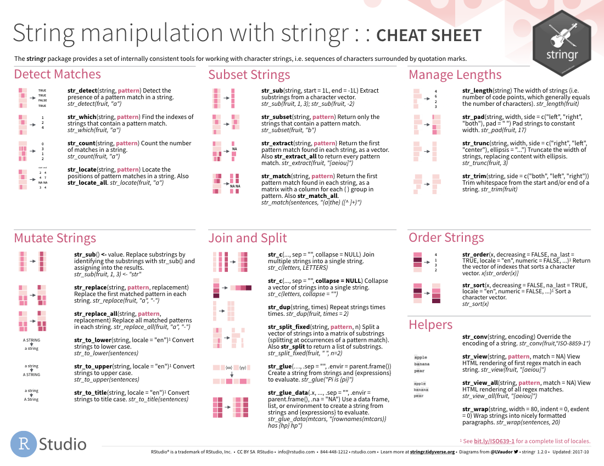

*This content was presented to Nelson\\Nygaard Staff at a Lunch and Learn webinar on Wednesday, March 3rd, 2021, and is [available as a recording here](https://web.microsoftstream.com/video/89d6ac28-ddde-4e8f-863c-438b166f3e2b) and embedded below.*

<p align="center"><iframe width="640" height="360" src="https://web.microsoftstream.com/video/89d6ac28-ddde-4e8f-863c-438b166f3e2b?autoplay=false&amp;showinfo=true" allowfullscreen style="border:none;"></iframe></p>

__Acknowledgement:__ This module heavily draws upon Hadley Wickham's (the progenitor of the Tidyverse) book (available for free online), [R for Data Science](https://r4ds.had.co.nz/), including text, pictures, and code directly copied from that book and slightly modified to suit a shorter narrative. Printed copies are available generally wherever you get your books. It is recommended that you read this book for a deeper understanding of the topics contained hereien -- only basic concepts are able to be covered within the time available. 

## Introduction

This module introduces you to string manipulation in R. You'll learn the basics of how strings work and how to create them by hand, but the focus of this module will be on regular expressions, or regexps for short. Regular expressions are useful because strings usually contain unstructured or semi-structured data, and regexps are a concise language for describing patterns in strings. When you first look at a regexp, you'll think a cat walked across your keyboard, but as your understanding improves they will soon start to make sense.

### Prerequisites

This module will focus on the __stringr__ package for string manipulation, which is part of the core tidyverse.

```{r setup, message = FALSE}
library(tidyverse)
```

## String basics

You can create strings with either single quotes or double quotes. Unlike other languages, there is no difference in behavior. I recommend always using `"`, unless you want to create a string that contains multiple `"`.

```{r}
string1 <- "This is a string"
string2 <- 'If I want to include a "quote" inside a string, I use single quotes'
```

If you forget to close a quote, you'll see `+`, the continuation character:

```
> "This is a string without a closing quote
+ 
+ 
+ HELP I'M STUCK
```

If this happen to you, press Escape and try again!

To include a literal single or double quote in a string you can use `\` to "escape" it:

```{r}
double_quote <- "\"" # or '"'
single_quote <- '\'' # or "'"
```

That means if you want to include a literal backslash, you'll need to double it up: `"\\"`.

Beware that the printed representation of a string is not the same as string itself, because the printed representation shows the escapes. To see the raw contents of the string, use `writeLines()`:

```{r}
x <- c("\"", "\\")
x
writeLines(x)
```

There are a handful of other special characters. The most common are `"\n"`, newline, and `"\t"`, tab, but you can see the complete list by requesting help on `"`: `?'"'`, or `?"'"`. You'll also sometimes see strings like `"\u00b5"`, this is a way of writing non-English characters that works on all platforms:

```{r}
x <- "\u00b5"
x
```

Multiple strings are often stored in a character vector, which you can create with `c()`:

```{r}
c("one", "two", "three")
```

### String length

Base R contains many functions to work with strings but we'll avoid them because they can be inconsistent, which makes them hard to remember. Instead we'll use functions from `stringr`. These have more intuitive names, and all start with `str_`. For example, `str_length()` tells you the number of characters in a string:

```{r}
str_length(c("a", "R for data science", NA))
```

The common `str_` prefix is particularly useful if you use RStudio, because typing `str_` will trigger auto-complete, allowing you to see all `stringr` functions:

```{r, echo = FALSE}
knitr::include_graphics("images/stringr-autocomplete.png")
```

### Combining strings

To combine two or more strings, use `str_c()`. This is very much like the `paste0()` function:

```{r}
str_c("x", "y")
str_c("x", "y", "z")
```

Use the `sep` argument to control how they're separated:

```{r}
str_c("x", "y", sep = ", ")
```

Like most other functions in R, missing values are contagious. If you want them to print as `"NA"`, use `str_replace_na()`:

```{r}
x <- c("abc", NA)
str_c("|-", x, "-|")
str_c("|-", str_replace_na(x), "-|")
```

As shown above, `str_c()` is vectorised, and it automatically recycles shorter vectors to the same length as the longest:

```{r}
str_c("prefix-", c("a", "b", "c"), "-suffix")
```

Objects of length 0 are silently dropped. This is particularly useful in conjunction with `if`:

```{r}
name <- "Hadley"
time_of_day <- "morning"
birthday <- FALSE

str_c(
  "Good ", time_of_day, " ", name,
  if (birthday) " and HAPPY BIRTHDAY",
  "."
)
```

To collapse a vector of strings into a single string, use `collapse`:

```{r}
str_c(c("x", "y", "z"), collapse = ", ")
```

### Subsetting strings

You can extract parts of a string using `str_sub()`. As well as the string, `str_sub()` takes `start` and `end` arguments which give the (inclusive) position of the sub-string:

```{r}
x <- c("Apple", "Banana", "Pear")
str_sub(x, 1, 3)
# negative numbers count backwards from end
str_sub(x, -3, -1)
```

Note that `str_sub()` won't fail if the string is too short: it will just return as much as possible:

```{r}
str_sub("a", 1, 5)
```

You can also use the assignment form of `str_sub()` to modify strings:

```{r}
str_sub(x, 1, 1) <- str_to_lower(str_sub(x, 1, 1))
x
```

### Locales

Above I used `str_to_lower()` to change the text to lower case. You can also use `str_to_upper()` or `str_to_title()`. However, changing case is more complicated than it might at first appear because different languages have different rules for changing case. You can pick which set of rules to use by specifying a locale:

```{r}
# Turkish has two i's: with and without a dot, and it
# has a different rule for capitalising them:
str_to_upper(c("i", "ı"))
str_to_upper(c("i", "ı"), locale = "tr")
```

The locale is specified as a ISO 639 language code, which is a two or three letter abbreviation. If you don't already know the code for your language, [Wikipedia](https://en.wikipedia.org/wiki/List_of_ISO_639-1_codes) has a good list. If you leave the locale blank, it will use the current locale, as provided by your operating system.

Another important operation that's affected by the locale is sorting. The base R `order()` and `sort()` functions sort strings using the current locale. If you want robust behaviour across different computers, you may want to use `str_sort()` and `str_order()` which take an additional `locale` argument:

```{r}
x <- c("apple", "eggplant", "banana")

str_sort(x, locale = "en")  # English

str_sort(x, locale = "haw") # Hawaiian
```

## Matching patterns with regular expressions

Regexps are a very terse language that allow you to describe patterns in strings. They take a little while to get your head around, but once you understand them, you'll find them extremely useful. 

To learn regular expressions, we'll use `str_view()` and `str_view_all()`. These functions take a character vector and a regular expression, and show you how they match. We'll start with very simple regular expressions and then gradually get more and more complicated. Once you've mastered pattern matching, you'll learn how to apply those ideas with various `stringr` functions.

### Basic matches

The simplest patterns match exact strings:

```{r}
x <- c("apple", "banana", "pear")
str_view(x, "an")
```

The next step up in complexity is `.`, which matches any character (except a newline):

```{r}
str_view(x, ".a.")
```

But if "`.`" matches any character, how do you match the character "`.`"? You need to use an "escape" to tell the regular expression you want to match it exactly, not use its special behavior. Like strings, regexps use the backslash, `\`, to escape special behavior. So to match an `.`, you need the regexp `\.`. Unfortunately this creates a problem. We use strings to represent regular expressions, and `\` is also used as an escape symbol in strings. So to create the regular expression `\.` we need the string `"\\."`. 

```{r}
# To create the regular expression, we need \\
dot <- "\\."

# But the expression itself only contains one:
writeLines(dot)

# And this tells R to look for an explicit .
str_view(c("abc", "a.c", "bef"), "a\\.c")
```

If `\` is used as an escape character in regular expressions, how do you match a literal `\`? Well you need to escape it, creating the regular expression `\\`. To create that regular expression, you need to use a string, which also needs to escape `\`. That means to match a literal `\` you need to write `"\\\\"` --- you need four backslashes to match one!

```{r}
x <- "a\\b"
writeLines(x)

str_view(x, "\\\\")
```

### Anchors

By default, regular expressions will match any part of a string. It's often useful to _anchor_ the regular expression so that it matches from the start or end of the string. You can use:

* `^` to match the start of the string.
* `$` to match the end of the string.

```{r}
x <- c("apple", "banana", "pear")
str_view(x, "^a")
str_view(x, "a$")
```

To force a regular expression to only match a complete string, anchor it with both `^` and `$`:

```{r}
x <- c("apple pie", "apple", "apple cake")
str_view(x, "apple")
str_view(x, "^apple$")
```

You can also match the boundary between words with `\b`. I don't often use this in R, but I will sometimes use it when I'm doing a search in RStudio when I want to find the name of a function that's a component of other functions. For example, I'll search for `\bsum\b` to avoid matching `summarise`, `summary`, `rowsum` and so on.

### Character classes and alternatives

There are a number of special patterns that match more than one character. You've already seen `.`, which matches any character apart from a newline. There are four other useful tools:

* `\d`: matches any digit.
* `\s`: matches any white-space (e.g. space, tab, newline).
* `[abc]`: matches a, b, or c.
* `[^abc]`: matches anything except a, b, or c.

Remember, to create a regular expression containing `\d` or `\s`, you'll need to escape the `\` for the string, so you'll type `"\\d"` or `"\\s"`.

A character class containing a single character is a nice alternative to backslash escapes when you want to include a single meta-character in a regex. Many people find this more readable.

```{r}
# Look for a literal character that normally has special meaning in a regex
str_view(c("abc", "a.c", "a*c", "a c"), "a[.]c")
str_view(c("abc", "a.c", "a*c", "a c"), ".[*]c")
str_view(c("abc", "a.c", "a*c", "a c"), "a[ ]")
```

This works for most (but not all) regex meta-characters: `$` `.` `|` `?` `*` `+` `(` `)` `[` `{`. Unfortunately, a few characters have special meaning even inside a character class and must be handled with backslash escapes: `]` `\` `^` and `-`.

You can use _alternation_ to pick between one or more alternative patterns. For example, `abc|d..f` will match either '"abc"', or `"deaf"`. Note that the precedence for `|` is low, so that `abc|xyz` matches `abc` or `xyz` not `abcyz` or `abxyz`. Like with mathematical expressions, if precedence ever gets confusing, use parentheses to make it clear what you want:

```{r}
str_view(c("grey", "gray"), "gr(e|a)y")
```

### Repetition

The next step up in power involves controlling how many times a pattern matches:

* `?`: 0 or 1
* `+`: 1 or more
* `*`: 0 or more

```{r}
x <- "1888 is the longest year in Roman numerals: MDCCCLXXXVIII"
str_view(x, "CC?")
str_view(x, "CC+")
str_view(x, 'C[LX]+')
```

Note that the precedence of these operators is high, so you can write: `colou?r` to match either American or British spellings. That means most uses will need parentheses, like `bana(na)+`.

You can also specify the number of matches precisely:

* `{n}`: exactly n
* `{n,}`: n or more
* `{,m}`: at most m
* `{n,m}`: between n and m

```{r}
str_view(x, "C{2}")
str_view(x, "C{2,}")
str_view(x, "C{2,3}")
```

By default these matches are "greedy": they will match the longest string possible. You can make them "lazy", matching the shortest string possible by putting a `?` after them. This is an advanced feature of regular expressions, but it's useful to know that it exists:

```{r}
str_view(x, 'C{2,3}?')
str_view(x, 'C[LX]+?')
```

### Grouping and backreferences

Earlier, you learned about parentheses as a way to disambiguate complex expressions. Parentheses also create a _numbered_ capturing group (number 1, 2 etc.). A capturing group stores _the part of the string_ matched by the part of the regular expression inside the parentheses. You can refer to the same text as previously matched by a capturing group with _backreferences_, like `\1`, `\2` etc. For example, the following regular expression finds all fruits that have a repeated pair of letters.

```{r}
str_view(fruit, "(..)\\1", match = TRUE)
```

(Shortly, you'll also see how they're useful in conjunction with `str_match()`.)

## Tools

Now that you've learned the basics of regular expressions, it's time to learn how to apply them to real problems. In this section you'll learn a wide array of `stringr` functions that let you:

* Determine which strings match a pattern.
* Find the positions of matches.
* Extract the content of matches.
* Replace matches with new values.
* Split a string based on a match.

A word of caution before we continue: because regular expressions are so powerful, it's easy to try and solve every problem with a single regular expression. In the words of Jamie Zawinski:

> Some people, when confronted with a problem, think “I know, I’ll use regular
> expressions.” Now they have two problems. 

As a cautionary tale, check out this regular expression that checks if a email address is valid:

```
(?:(?:\r\n)?[ \t])*(?:(?:(?:[^()<>@,;:\\".\[\] \000-\031]+(?:(?:(?:\r\n)?[ \t]
)+|\Z|(?=[\["()<>@,;:\\".\[\]]))|"(?:[^\"\r\\]|\\.|(?:(?:\r\n)?[ \t]))*"(?:(?:
\r\n)?[ \t])*)(?:\.(?:(?:\r\n)?[ \t])*(?:[^()<>@,;:\\".\[\] \000-\031]+(?:(?:(
?:\r\n)?[ \t])+|\Z|(?=[\["()<>@,;:\\".\[\]]))|"(?:[^\"\r\\]|\\.|(?:(?:\r\n)?[ 
\t]))*"(?:(?:\r\n)?[ \t])*))*@(?:(?:\r\n)?[ \t])*(?:[^()<>@,;:\\".\[\] \000-\0
31]+(?:(?:(?:\r\n)?[ \t])+|\Z|(?=[\["()<>@,;:\\".\[\]]))|\[([^\[\]\r\\]|\\.)*\
](?:(?:\r\n)?[ \t])*)(?:\.(?:(?:\r\n)?[ \t])*(?:[^()<>@,;:\\".\[\] \000-\031]+
(?:(?:(?:\r\n)?[ \t])+|\Z|(?=[\["()<>@,;:\\".\[\]]))|\[([^\[\]\r\\]|\\.)*\](?:
(?:\r\n)?[ \t])*))*|(?:[^()<>@,;:\\".\[\] \000-\031]+(?:(?:(?:\r\n)?[ \t])+|\Z
|(?=[\["()<>@,;:\\".\[\]]))|"(?:[^\"\r\\]|\\.|(?:(?:\r\n)?[ \t]))*"(?:(?:\r\n)
?[ \t])*)*\<(?:(?:\r\n)?[ \t])*(?:@(?:[^()<>@,;:\\".\[\] \000-\031]+(?:(?:(?:\
r\n)?[ \t])+|\Z|(?=[\["()<>@,;:\\".\[\]]))|\[([^\[\]\r\\]|\\.)*\](?:(?:\r\n)?[
 \t])*)(?:\.(?:(?:\r\n)?[ \t])*(?:[^()<>@,;:\\".\[\] \000-\031]+(?:(?:(?:\r\n)
?[ \t])+|\Z|(?=[\["()<>@,;:\\".\[\]]))|\[([^\[\]\r\\]|\\.)*\](?:(?:\r\n)?[ \t]
)*))*(?:,@(?:(?:\r\n)?[ \t])*(?:[^()<>@,;:\\".\[\] \000-\031]+(?:(?:(?:\r\n)?[
 \t])+|\Z|(?=[\["()<>@,;:\\".\[\]]))|\[([^\[\]\r\\]|\\.)*\](?:(?:\r\n)?[ \t])*
)(?:\.(?:(?:\r\n)?[ \t])*(?:[^()<>@,;:\\".\[\] \000-\031]+(?:(?:(?:\r\n)?[ \t]
)+|\Z|(?=[\["()<>@,;:\\".\[\]]))|\[([^\[\]\r\\]|\\.)*\](?:(?:\r\n)?[ \t])*))*)
*:(?:(?:\r\n)?[ \t])*)?(?:[^()<>@,;:\\".\[\] \000-\031]+(?:(?:(?:\r\n)?[ \t])+
|\Z|(?=[\["()<>@,;:\\".\[\]]))|"(?:[^\"\r\\]|\\.|(?:(?:\r\n)?[ \t]))*"(?:(?:\r
\n)?[ \t])*)(?:\.(?:(?:\r\n)?[ \t])*(?:[^()<>@,;:\\".\[\] \000-\031]+(?:(?:(?:
\r\n)?[ \t])+|\Z|(?=[\["()<>@,;:\\".\[\]]))|"(?:[^\"\r\\]|\\.|(?:(?:\r\n)?[ \t
]))*"(?:(?:\r\n)?[ \t])*))*@(?:(?:\r\n)?[ \t])*(?:[^()<>@,;:\\".\[\] \000-\031
]+(?:(?:(?:\r\n)?[ \t])+|\Z|(?=[\["()<>@,;:\\".\[\]]))|\[([^\[\]\r\\]|\\.)*\](
?:(?:\r\n)?[ \t])*)(?:\.(?:(?:\r\n)?[ \t])*(?:[^()<>@,;:\\".\[\] \000-\031]+(?
:(?:(?:\r\n)?[ \t])+|\Z|(?=[\["()<>@,;:\\".\[\]]))|\[([^\[\]\r\\]|\\.)*\](?:(?
:\r\n)?[ \t])*))*\>(?:(?:\r\n)?[ \t])*)|(?:[^()<>@,;:\\".\[\] \000-\031]+(?:(?
:(?:\r\n)?[ \t])+|\Z|(?=[\["()<>@,;:\\".\[\]]))|"(?:[^\"\r\\]|\\.|(?:(?:\r\n)?
[ \t]))*"(?:(?:\r\n)?[ \t])*)*:(?:(?:\r\n)?[ \t])*(?:(?:(?:[^()<>@,;:\\".\[\] 
\000-\031]+(?:(?:(?:\r\n)?[ \t])+|\Z|(?=[\["()<>@,;:\\".\[\]]))|"(?:[^\"\r\\]|
\\.|(?:(?:\r\n)?[ \t]))*"(?:(?:\r\n)?[ \t])*)(?:\.(?:(?:\r\n)?[ \t])*(?:[^()<>
@,;:\\".\[\] \000-\031]+(?:(?:(?:\r\n)?[ \t])+|\Z|(?=[\["()<>@,;:\\".\[\]]))|"
(?:[^\"\r\\]|\\.|(?:(?:\r\n)?[ \t]))*"(?:(?:\r\n)?[ \t])*))*@(?:(?:\r\n)?[ \t]
)*(?:[^()<>@,;:\\".\[\] \000-\031]+(?:(?:(?:\r\n)?[ \t])+|\Z|(?=[\["()<>@,;:\\
".\[\]]))|\[([^\[\]\r\\]|\\.)*\](?:(?:\r\n)?[ \t])*)(?:\.(?:(?:\r\n)?[ \t])*(?
:[^()<>@,;:\\".\[\] \000-\031]+(?:(?:(?:\r\n)?[ \t])+|\Z|(?=[\["()<>@,;:\\".\[
\]]))|\[([^\[\]\r\\]|\\.)*\](?:(?:\r\n)?[ \t])*))*|(?:[^()<>@,;:\\".\[\] \000-
\031]+(?:(?:(?:\r\n)?[ \t])+|\Z|(?=[\["()<>@,;:\\".\[\]]))|"(?:[^\"\r\\]|\\.|(
?:(?:\r\n)?[ \t]))*"(?:(?:\r\n)?[ \t])*)*\<(?:(?:\r\n)?[ \t])*(?:@(?:[^()<>@,;
:\\".\[\] \000-\031]+(?:(?:(?:\r\n)?[ \t])+|\Z|(?=[\["()<>@,;:\\".\[\]]))|\[([
^\[\]\r\\]|\\.)*\](?:(?:\r\n)?[ \t])*)(?:\.(?:(?:\r\n)?[ \t])*(?:[^()<>@,;:\\"
.\[\] \000-\031]+(?:(?:(?:\r\n)?[ \t])+|\Z|(?=[\["()<>@,;:\\".\[\]]))|\[([^\[\
]\r\\]|\\.)*\](?:(?:\r\n)?[ \t])*))*(?:,@(?:(?:\r\n)?[ \t])*(?:[^()<>@,;:\\".\
[\] \000-\031]+(?:(?:(?:\r\n)?[ \t])+|\Z|(?=[\["()<>@,;:\\".\[\]]))|\[([^\[\]\
r\\]|\\.)*\](?:(?:\r\n)?[ \t])*)(?:\.(?:(?:\r\n)?[ \t])*(?:[^()<>@,;:\\".\[\] 
\000-\031]+(?:(?:(?:\r\n)?[ \t])+|\Z|(?=[\["()<>@,;:\\".\[\]]))|\[([^\[\]\r\\]
|\\.)*\](?:(?:\r\n)?[ \t])*))*)*:(?:(?:\r\n)?[ \t])*)?(?:[^()<>@,;:\\".\[\] \0
00-\031]+(?:(?:(?:\r\n)?[ \t])+|\Z|(?=[\["()<>@,;:\\".\[\]]))|"(?:[^\"\r\\]|\\
.|(?:(?:\r\n)?[ \t]))*"(?:(?:\r\n)?[ \t])*)(?:\.(?:(?:\r\n)?[ \t])*(?:[^()<>@,
;:\\".\[\] \000-\031]+(?:(?:(?:\r\n)?[ \t])+|\Z|(?=[\["()<>@,;:\\".\[\]]))|"(?
:[^\"\r\\]|\\.|(?:(?:\r\n)?[ \t]))*"(?:(?:\r\n)?[ \t])*))*@(?:(?:\r\n)?[ \t])*
(?:[^()<>@,;:\\".\[\] \000-\031]+(?:(?:(?:\r\n)?[ \t])+|\Z|(?=[\["()<>@,;:\\".
\[\]]))|\[([^\[\]\r\\]|\\.)*\](?:(?:\r\n)?[ \t])*)(?:\.(?:(?:\r\n)?[ \t])*(?:[
^()<>@,;:\\".\[\] \000-\031]+(?:(?:(?:\r\n)?[ \t])+|\Z|(?=[\["()<>@,;:\\".\[\]
]))|\[([^\[\]\r\\]|\\.)*\](?:(?:\r\n)?[ \t])*))*\>(?:(?:\r\n)?[ \t])*)(?:,\s*(
?:(?:[^()<>@,;:\\".\[\] \000-\031]+(?:(?:(?:\r\n)?[ \t])+|\Z|(?=[\["()<>@,;:\\
".\[\]]))|"(?:[^\"\r\\]|\\.|(?:(?:\r\n)?[ \t]))*"(?:(?:\r\n)?[ \t])*)(?:\.(?:(
?:\r\n)?[ \t])*(?:[^()<>@,;:\\".\[\] \000-\031]+(?:(?:(?:\r\n)?[ \t])+|\Z|(?=[
\["()<>@,;:\\".\[\]]))|"(?:[^\"\r\\]|\\.|(?:(?:\r\n)?[ \t]))*"(?:(?:\r\n)?[ \t
])*))*@(?:(?:\r\n)?[ \t])*(?:[^()<>@,;:\\".\[\] \000-\031]+(?:(?:(?:\r\n)?[ \t
])+|\Z|(?=[\["()<>@,;:\\".\[\]]))|\[([^\[\]\r\\]|\\.)*\](?:(?:\r\n)?[ \t])*)(?
:\.(?:(?:\r\n)?[ \t])*(?:[^()<>@,;:\\".\[\] \000-\031]+(?:(?:(?:\r\n)?[ \t])+|
\Z|(?=[\["()<>@,;:\\".\[\]]))|\[([^\[\]\r\\]|\\.)*\](?:(?:\r\n)?[ \t])*))*|(?:
[^()<>@,;:\\".\[\] \000-\031]+(?:(?:(?:\r\n)?[ \t])+|\Z|(?=[\["()<>@,;:\\".\[\
]]))|"(?:[^\"\r\\]|\\.|(?:(?:\r\n)?[ \t]))*"(?:(?:\r\n)?[ \t])*)*\<(?:(?:\r\n)
?[ \t])*(?:@(?:[^()<>@,;:\\".\[\] \000-\031]+(?:(?:(?:\r\n)?[ \t])+|\Z|(?=[\["
()<>@,;:\\".\[\]]))|\[([^\[\]\r\\]|\\.)*\](?:(?:\r\n)?[ \t])*)(?:\.(?:(?:\r\n)
?[ \t])*(?:[^()<>@,;:\\".\[\] \000-\031]+(?:(?:(?:\r\n)?[ \t])+|\Z|(?=[\["()<>
@,;:\\".\[\]]))|\[([^\[\]\r\\]|\\.)*\](?:(?:\r\n)?[ \t])*))*(?:,@(?:(?:\r\n)?[
 \t])*(?:[^()<>@,;:\\".\[\] \000-\031]+(?:(?:(?:\r\n)?[ \t])+|\Z|(?=[\["()<>@,
;:\\".\[\]]))|\[([^\[\]\r\\]|\\.)*\](?:(?:\r\n)?[ \t])*)(?:\.(?:(?:\r\n)?[ \t]
)*(?:[^()<>@,;:\\".\[\] \000-\031]+(?:(?:(?:\r\n)?[ \t])+|\Z|(?=[\["()<>@,;:\\
".\[\]]))|\[([^\[\]\r\\]|\\.)*\](?:(?:\r\n)?[ \t])*))*)*:(?:(?:\r\n)?[ \t])*)?
(?:[^()<>@,;:\\".\[\] \000-\031]+(?:(?:(?:\r\n)?[ \t])+|\Z|(?=[\["()<>@,;:\\".
\[\]]))|"(?:[^\"\r\\]|\\.|(?:(?:\r\n)?[ \t]))*"(?:(?:\r\n)?[ \t])*)(?:\.(?:(?:
\r\n)?[ \t])*(?:[^()<>@,;:\\".\[\] \000-\031]+(?:(?:(?:\r\n)?[ \t])+|\Z|(?=[\[
"()<>@,;:\\".\[\]]))|"(?:[^\"\r\\]|\\.|(?:(?:\r\n)?[ \t]))*"(?:(?:\r\n)?[ \t])
*))*@(?:(?:\r\n)?[ \t])*(?:[^()<>@,;:\\".\[\] \000-\031]+(?:(?:(?:\r\n)?[ \t])
+|\Z|(?=[\["()<>@,;:\\".\[\]]))|\[([^\[\]\r\\]|\\.)*\](?:(?:\r\n)?[ \t])*)(?:\
.(?:(?:\r\n)?[ \t])*(?:[^()<>@,;:\\".\[\] \000-\031]+(?:(?:(?:\r\n)?[ \t])+|\Z
|(?=[\["()<>@,;:\\".\[\]]))|\[([^\[\]\r\\]|\\.)*\](?:(?:\r\n)?[ \t])*))*\>(?:(
?:\r\n)?[ \t])*))*)?;\s*)
```

This is a somewhat pathological example (because email addresses are actually surprisingly complex), but is used in real code. See the stackoverflow discussion at <http://stackoverflow.com/a/201378> for more details. 

Don't forget that you're in a programming language and you have other tools at your disposal. Instead of creating one complex regular expression, it's often easier to write a series of simpler regexps. If you get stuck trying to create a single regexp that solves your problem, take a step back and think if you could break the problem down into smaller pieces, solving each challenge before moving onto the next one.

### Detect matches

To determine if a character vector matches a pattern, use `str_detect()`. It returns a logical vector the same length as the input:

```{r}
x <- c("apple", "banana", "pear")
str_detect(x, "e")
```

Remember that when you use a logical vector in a numeric context, `FALSE` becomes 0 and `TRUE` becomes 1. That makes `sum()` and `mean()` useful if you want to answer questions about matches across a larger vector:

```{r}
# How many common words start with t?
sum(str_detect(words, "^t"))
# What proportion of common words end with a vowel?
mean(str_detect(words, "[aeiou]$"))
```

When you have complex logical conditions (e.g. match a or b but not c unless d) it's often easier to combine multiple `str_detect()` calls with logical operators, rather than trying to create a single regular expression. For example, here are two ways to find all words that don't contain any vowels:

```{r}
# Find all words containing at least one vowel, and negate
no_vowels_1 <- !str_detect(words, "[aeiou]")
# Find all words consisting only of consonants (non-vowels)
no_vowels_2 <- str_detect(words, "^[^aeiou]+$")
identical(no_vowels_1, no_vowels_2)
```

The results are identical, but I think the first approach is significantly easier to understand. If your regular expression gets overly complicated, try breaking it up into smaller pieces, giving each piece a name, and then combining the pieces with logical operations.

A common use of `str_detect()` is to select the elements that match a pattern. You can do this with logical subsetting, or the convenient `str_subset()` wrapper:

```{r}
words[str_detect(words, "x$")]
str_subset(words, "x$")
```

Typically, however, your strings will be one column of a data frame, and you'll want to use filter instead:

```{r}
df <- tibble(
  word = words, 
  i = seq_along(word)
)
df %>% 
  filter(str_detect(word, "x$"))
```

A variation on `str_detect()` is `str_count()`: rather than a simple yes or no, it tells you how many matches there are in a string:

```{r}
x <- c("apple", "banana", "pear")
str_count(x, "a")

# On average, how many vowels per word?
mean(str_count(words, "[aeiou]"))
```

It's natural to use `str_count()` with `mutate()`:

```{r}
df %>% 
  mutate(
    vowels = str_count(word, "[aeiou]"),
    consonants = str_count(word, "[^aeiou]")
  )
```

Note that matches never overlap. For example, in `"abababa"`, how many times will the pattern `"aba"` match? Regular expressions say two, not three:

```{r}
str_count("abababa", "aba")
str_view_all("abababa", "aba")
```

Note the use of `str_view_all()`. As you'll shortly learn, many stringr functions come in pairs: one function works with a single match, and the other works with all matches. The second function will have the suffix `_all`.

### Extract matches

To extract the actual text of a match, use `str_extract()`. To show that off, we're going to need a more complicated example. I'm going to use the [Harvard sentences](https://en.wikipedia.org/wiki/Harvard_sentences), which were designed to test VOIP systems, but are also useful for practicing regexps. These are provided in `stringr::sentences`:

```{r}
length(sentences)
head(sentences)
```

Imagine we want to find all sentences that contain a color. We first create a vector of color names, and then turn it into a single regular expression:

```{r}
colors <- c("red", "orange", "yellow", "green", "blue", "purple")
color_match <- str_c(colors, collapse = "|")
color_match
```

Now we can select the sentences that contain a color, and then extract the color to figure out which one it is:

```{r}
has_color <- str_subset(sentences, color_match)
matches <- str_extract(has_color, color_match)
head(matches)
```

Note that `str_extract()` only extracts the first match. We can see that most easily by first selecting all the sentences that have more than 1 match:

```{r}
more <- sentences[str_count(sentences, color_match) > 1]
str_view_all(more, color_match)

str_extract(more, color_match)
```

This is a common pattern for `stringr` functions, because working with a single match allows you to use much simpler data structures. To get all matches, use `str_extract_all()`. It returns a list:

```{r}
str_extract_all(more, color_match)
```

If you use `simplify = TRUE`, `str_extract_all()` will return a matrix with short matches expanded to the same length as the longest:

```{r}
str_extract_all(more, color_match, simplify = TRUE)

x <- c("a", "a b", "a b c")
str_extract_all(x, "[a-z]", simplify = TRUE)
```

### Grouped matches

Earlier in this chapter we talked about the use of parentheses for clarifying precedence and for back-references when matching. You can also use parentheses to extract parts of a complex match. For example, imagine we want to extract nouns from the sentences. As a heuristic, we'll look for any word that comes after "a" or "the". Defining a "word" in a regular expression is a little tricky, so here I use a simple approximation: a sequence of at least one character that isn't a space.

```{r}
noun <- "(a|the) ([^ ]+)"

has_noun <- sentences %>%
  str_subset(noun) %>%
  head(10)
has_noun %>% 
  str_extract(noun)
```

`str_extract()` gives us the complete match; `str_match()` gives each individual component. Instead of a character vector, it returns a matrix, with one column for the complete match followed by one column for each group:

```{r}
has_noun %>% 
  str_match(noun)
```

(Unsurprisingly, our heuristic for detecting nouns is poor, and also picks up adjectives like smooth and parked.)

If your data is in a tibble, it's often easier to use `tidyr::extract()`. It works like `str_match()` but requires you to name the matches, which are then placed in new columns:

```{r}
tibble(sentence = sentences) %>% 
  tidyr::extract(
    sentence, c("article", "noun"), "(a|the) ([^ ]+)", 
    remove = FALSE
  )
```

Like `str_extract()`, if you want all matches for each string, you'll need `str_match_all()`.

### Replacing matches

`str_replace()` and `str_replace_all()` allow you to replace matches with new strings. The simplest use is to replace a pattern with a fixed string:

```{r}
x <- c("apple", "pear", "banana")
str_replace(x, "[aeiou]", "-")
str_replace_all(x, "[aeiou]", "-")
```

With `str_replace_all()` you can perform multiple replacements by supplying a named vector:

```{r}
x <- c("1 house", "2 cars", "3 people")
str_replace_all(x, c("1" = "one", "2" = "two", "3" = "three"))
```

Instead of replacing with a fixed string you can use backreferences to insert components of the match. In the following code, I flip the order of the second and third words.

```{r}
sentences %>% 
  str_replace("([^ ]+) ([^ ]+) ([^ ]+)", "\\1 \\3 \\2") %>% 
  head(5)
```

### Splitting

Use `str_split()` to split a string up into pieces. For example, we could split sentences into words:

```{r}
sentences %>%
  head(5) %>% 
  str_split(" ")
```

Because each component might contain a different number of pieces, this returns a list. If you're working with a length-1 vector, the easiest thing is to just extract the first element of the list:

```{r}
"a|b|c|d" %>% 
  str_split("\\|") %>% 
  .[[1]]
```

Otherwise, like the other `stringr` functions that return a list, you can use `simplify = TRUE` to return a matrix:

```{r}
sentences %>%
  head(5) %>% 
  str_split(" ", simplify = TRUE)
```

You can also request a maximum number of pieces:

```{r}
fields <- c("Name: Hadley", "Country: NZ", "Age: 35")
fields %>% str_split(": ", n = 2, simplify = TRUE)
```

Instead of splitting up strings by patterns, you can also split up by character, line, sentence and word `boundary()`s:

```{r}
x <- "This is a sentence.  This is another sentence."
str_view_all(x, boundary("word"))

str_split(x, " ")[[1]]
str_split(x, boundary("word"))[[1]]
```

### Find matches

`str_locate()` and `str_locate_all()` give you the starting and ending positions of each match. These are particularly useful when none of the other functions does exactly what you want. You can use `str_locate()` to find the matching pattern, `str_sub()` to extract and/or modify them.

## Other types of pattern

When you use a pattern that's a string, it's automatically wrapped into a call to `regex()`:

```{r, eval = FALSE}
# The regular call:
str_view(fruit, "nana")
# Is shorthand for
str_view(fruit, regex("nana"))
```

You can use the other arguments of `regex()` to control details of the match:

*   `ignore_case = TRUE` allows characters to match either their uppercase or 
    lowercase forms. This always uses the current locale.
    
    ```{r}
    bananas <- c("banana", "Banana", "BANANA")
    str_view(bananas, "banana")
    str_view(bananas, regex("banana", ignore_case = TRUE))
    ```
    
*   `multiline = TRUE` allows `^` and `$` to match the start and end of each
    line rather than the start and end of the complete string.
    
    ```{r}
    x <- "Line 1\nLine 2\nLine 3"
    str_extract_all(x, "^Line")[[1]]
    str_extract_all(x, regex("^Line", multiline = TRUE))[[1]]
    ```
    
*   `comments = TRUE` allows you to use comments and white space to make 
    complex regular expressions more understandable. Spaces are ignored, as is 
    everything after `#`. To match a literal space, you'll need to escape it: 
    `"\\ "`.
    
    ```{r}
    phone <- regex("
      \\(?     # optional opening parens
      (\\d{3}) # area code
      [) -]?   # optional closing parens, space, or dash
      (\\d{3}) # another three numbers
      [ -]?    # optional space or dash
      (\\d{3}) # three more numbers
      ", comments = TRUE)
    
    str_match("514-791-8141", phone)
    ```

*   `dotall = TRUE` allows `.` to match everything, including `\n`.

There are three other functions you can use instead of `regex()`:

*   `fixed()`: matches exactly the specified sequence of bytes. It ignores
    all special regular expressions and operates at a very low level. 
    This allows you to avoid complex escaping and can be much faster than 
    regular expressions. The following micro-benchmark shows that it's about
    3x faster for a simple example.
  
    ```{r}
    microbenchmark::microbenchmark(
      fixed = str_detect(sentences, fixed("the")),
      regex = str_detect(sentences, "the"),
      times = 20
    )
    ```
    
    Beware using `fixed()` with non-English data. It is problematic because 
    there are often multiple ways of representing the same character. For 
    example, there are two ways to define "á": either as a single character or 
    as an "a" plus an accent:
    
    ```{r}
    a1 <- "\u00e1"
    a2 <- "a\u0301"
    c(a1, a2)
    a1 == a2
    ```

    They render identically, but because they're defined differently, 
    `fixed()` doesn't find a match. Instead, you can use `coll()`, defined
    next, to respect human character comparison rules:

    ```{r}
    str_detect(a1, fixed(a2))
    str_detect(a1, coll(a2))
    ```
    
*   `coll()`: compare strings using standard **coll**ation rules. This is 
    useful for doing case insensitive matching. Note that `coll()` takes a
    `locale` parameter that controls which rules are used for comparing
    characters. Unfortunately different parts of the world use different rules!

    ```{r}
    # That means you also need to be aware of the difference
    # when doing case insensitive matches:
    i <- c("I", "İ", "i", "ı")
    i
    
    str_subset(i, coll("i", ignore_case = TRUE))
    str_subset(i, coll("i", ignore_case = TRUE, locale = "tr"))
    ```
    
    Both `fixed()` and `regex()` have `ignore_case` arguments, but they
    do not allow you to pick the locale: they always use the default locale.
    You can see what that is with the following code; more on stringi
    later.
    
    ```{r}
    stringi::stri_locale_info()
    ```
    
    The downside of `coll()` is speed; because the rules for recognising which
    characters are the same are complicated, `coll()` is relatively slow
    compared to `regex()` and `fixed()`.

*   As you saw with `str_split()` you can use `boundary()` to match boundaries.
    You can also use it with the other functions: 
    
    ```{r}
    x <- "This is a sentence."
    str_view_all(x, boundary("word"))
    str_extract_all(x, boundary("word"))
    ```

## Other uses of regular expressions

There are two useful function in base R that also use regular expressions:

*   `apropos()` searches all objects available from the global environment. This
    is useful if you can't quite remember the name of the function.
    
    ```{r}
    apropos("replace")
    ```
    
*   `dir()` lists all the files in a directory. The `pattern` argument takes
    a regular expression and only returns file names that match the pattern.
    For example, you can find all the R Markdown files in the current
    directory with:
    
    ```{r}
    head(dir(pattern = "\\.Rmd$"))
    ```
    
    (If you're more comfortable with "globs" like `*.Rmd`, you can convert
    them to regular expressions with `glob2rx()`):

## stringi

stringr is built on top of the __stringi__ package. stringr is useful when you're learning because it exposes a minimal set of functions, which have been carefully picked to handle the most common string manipulation functions. stringi, on the other hand, is designed to be comprehensive. It contains almost every function you might ever need: stringi has `r length(getNamespaceExports("stringi"))` functions to stringr's `r length(getNamespaceExports("stringr"))`.

If you find yourself struggling to do something in stringr, it's worth taking a look at stringi. The packages work very similarly, so you should be able to translate your stringr knowledge in a natural way. The main difference is the prefix: `str_` vs. `stri_`.

# Reference Materials

## Cheat Sheets

- [](https://github.com/rstudio/cheatsheets/raw/master/strings.pdf)

## Further Reading 

- [R for Data Science](https://r4ds.had.co.nz/), by Garrett Grolemund and Hadley Wickham.
- [Advanced R](https://adv-r.hadley.nz/index.html), by Hadley Wickham.

## Related DataCamp Courses

- [String Manipulation with `stringr` in R](https://learn.datacamp.com/courses/string-manipulation-with-stringr-in-r) (4 hours)

*This content was presented to Nelson\\Nygaard Staff at a Lunch and Learn webinar on Wednesday, March 3rd, 2021, and is [available as a recording here](https://web.microsoftstream.com/video/89d6ac28-ddde-4e8f-863c-438b166f3e2b) and embedded at the top of the page.*
