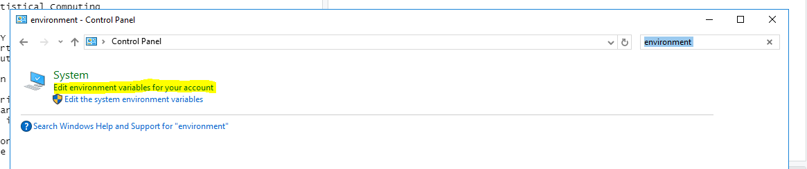
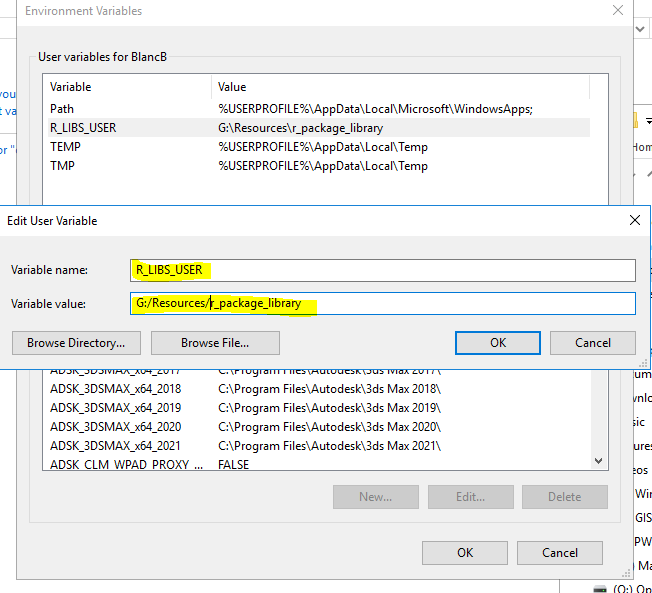
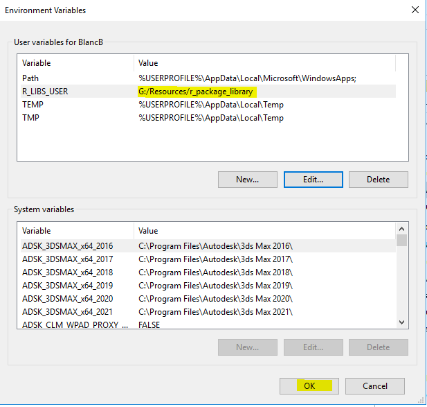
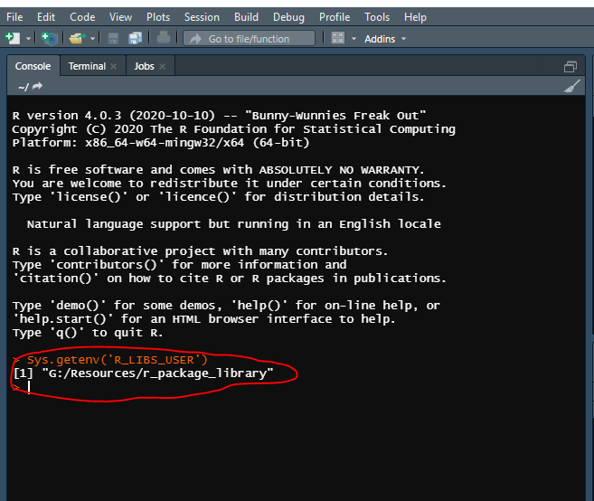

# First Steps

## DO THIS FIRST -- SETTING UP YOUR R PACKAGE LIBRARY

The **first** thing to do **before** opening RStudio on node is to set your R package library to the shared package library on the G Drive. You will only have to do this once, as the environment variable should be remembered on your user account even if you are using a different node computer. Previously, I recommended you do this by setting the environment variable with a line of R code. This does not appear to have a high enough level of permissions to make sure the change is consistent across node computers, so instead I have laid out steps below to do this through the Windows Control Panel.

### Step 1: Open the Environment Variables Settings for your User Account

The easiest way to access the environment variables settings is to open up Control Panel (within your Start menu), and then search for the settings using the keyword 'environment'. You will want to click on **'edit the environment variables'** link to open the dialog, as shown in the screenshot below.



### Step 2: Create a New Environment Variable

Click the 'New' button to create a new environment variable. Type in `R_LIBS_USER` for the variable name and `G:/Resources/r_package_library` for the variable value. Press OK.



### Step 3: Confirm Your New Variable has been Saved

Confirm your new variable is reflected in the list of user environment variables as below. Press OK to confirm.



### Step 4: Verify Settings in RStudio

You can verify that this environment variable is set to the correct value you set above anytime by running the following line of code:

```{r, eval=FALSE}
Sys.getenv(x = 'R_LIBS_USER')
```



It should return the path you just set above (`'G:/Resources/r_package_library'`) . If it does not for some reason, please contact [Bryan Blanc](mailto:bblanc@nelsonnygaard.com) to make him aware of the issue, and he will work with IT to help you resolve the issue.
