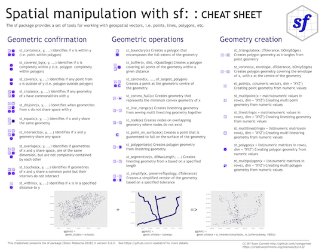
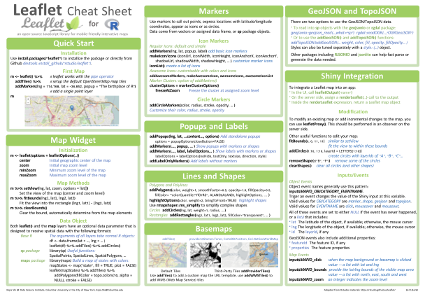

[Back to overview](../index.html)

*This content was presented to Nelson\\Nygaard Staff at a Lunch and Learn webinar on Friday, September 4th, 2020, and is [available as a recording here](https://web.microsoftstream.com/video/d331753a-e974-4561-a00c-9145fb77bdb4) and embedded below*

<p align="center"><iframe width="640" height="360" src="https://web.microsoftstream.com/embed/video/d331753a-e974-4561-a00c-9145fb77bdb4?autoplay=false&amp;showinfo=true" allowfullscreen style="border:none;"></iframe></p>

# Introduction

There are several reasons why learning to use the geospatial capabilities of R are invaluable for R users, especially at Nelson\\Nygaard:

- **Open source - no ESRI licenses neccessary**: R is a completely open source programming language, and so there are not licenses necessary to access its geospatial packages. NN as a firm has a limited number of licenses available at any given time, and the ongoing telecommuting associated with the COVID-19 pandemic has made using GIS licenses more difficult. R can allow you to conduct geospatial analyses on your local machine with no need for licenses. 
- **Combining spatial and aspatial analyses**: As transportation planners, most of the work we do has some spatial component. Because of that, analysis is often separated into GIS and Excel components. With R, that separation is unneccesary -- you can combine spatial and aspatial analysis procedures and data seamlessly. 
- **Automation and processing speed**: Like with all other R based analyses, you can automate analysis procedures you have to conduct many times over, potentially speeding up some GIS workflows that are repetitive. 
- **Modular**: Additionally, if written appropriately, commonly conducted analysis procedures can be abstracted into modular code that can be applied across different projects, saving time as a firm. 
- **Interactive**: Because of `leaflet`, which we will discuss below, R offers a very low barrier to quickly producing interactive maps, which are both helpful for data exploration and for presentation, especially as increasingly more deliverables move to digital formats. 

This module will discuss the spatial data package `sf`, which is well integrated into the tidyverse and other mapping related packages (including `leaflet`). There are other spatial data frameworks that came before `sf` that will not be discussed below (like `sp`) but are still relevant to understand at a basic level. Reference articles are included below.
Additionally, this module will discuss `leaflet`, an interactive mapping framework that lends itself well to spatial analysis and visualization in R. 

# Simple Features

*__Acknowledgment:__ This portion of this module heavily draws upon, including direct copy-paste of markdown content, the vignettes developed for the `sf` package, available on the package [documentation website](https://r-spatial.github.io/sf/index.html). *

[Simple features](https://en.wikipedia.org/wiki/Simple_Features) or [_simple feature access_](http://www.opengeospatial.org/standards/sfa) refers to a formal standard (ISO 19125-1:2004) that describes how objects in the real world can be represented in computers, with emphasis on the _spatial_ geometry of these objects. It also describes how such objects can be stored in and retrieved from databases, and which geometrical operations should be defined for them.

The standard is widely implemented in spatial
databases (such as PostGIS), commercial GIS (e.g., [ESRI
ArcGIS](http://www.esri.com/)) and forms the vector data basis for
libraries such as [GDAL](http://www.gdal.org/). A subset of
simple features forms the [GeoJSON](http://geojson.org/) standard.

R has well-supported classes for storing spatial
data ([sp](https://CRAN.R-project.org/package=sp))
and interfacing to the above mentioned environments
([rgdal](https://CRAN.R-project.org/package=rgdal),
[rgeos](https://CRAN.R-project.org/package=rgeos)), but has so far lacked a
complete implementation of simple features, making conversions
at times convoluted, inefficient or incomplete. The package
[sf](http://github.com/r-spatial/sf) tries to fill this gap, and aims
at succeeding [sp](https://CRAN.R-project.org/package=sp) in the
long term.

This vignette:

* explains what is meant by features, and by simple features
* shows how they are implemented in R
* provides examples of how you can work with them
* shows how they can be read from and written to external files or resources
* discusses how they can be converted to and from sp objects
* shows how they can be used for meaningful spatial analysis

## What is a feature?

A feature is thought of as a thing, or an object in the real world,
such as a building or a tree. As is the case with objects,
they often consist of other objects. This is the case with features
too: a set of features can form a single feature. A forest stand can
be a feature, a forest can be a feature, a city can be a feature.
A satellite image pixel can be a feature, a complete image can be
a feature too.

Features have a _geometry_ describing _where_ on Earth the
feature is located, and they have attributes, which describe other
properties. The geometry of a tree can be the delineation of
its crown, of its stem, or the point indicating its centre. Other
properties may include its height, color, diameter at breast height
at a particular date, and so on.

The standard says: "_A simple feature is defined by the OpenGIS
Abstract specification to have both spatial and non-spatial
attributes. Spatial attributes are geometry valued, and simple
features are based on 2D geometry with linear interpolation between
vertices._"  We will see soon that the same standard will extend
its coverage beyond 2D and beyond linear interpolation. Here, we
take simple features as the data structures and operations described
in the [standard](http://www.opengeospatial.org/standards/sfa).

### Dimensions

All geometries are composed of points. Points are coordinates in a
2-, 3- or 4-dimensional space.  All points in a geometry have the
same dimensionality. In addition to X and Y coordinates, there are
two optional additional dimensions:

* a Z coordinate, denoting altitude
* an M coordinate (rarely used), denoting some _measure_ that is associated with the point, rather than with the feature as a whole (in which case it would be a feature attribute); examples could be time of measurement, or measurement error of the coordinates

The four possible cases then are:

1. two-dimensional points refer to x and y, easting and northing, or longitude and latitude, we refer to them as XY
2. three-dimensional points as XYZ
3. three-dimensional points as XYM
4. four-dimensional points as XYZM (the third axis is Z, fourth M)

### Simple feature geometry types

The following seven simple feature types are the most common, and are for instance the only ones used for [GeoJSON](https://tools.ietf.org/html/rfc7946):

| type | description                                        |
| ---- | -------------------------------------------------- |
| `POINT` | zero-dimensional geometry containing a single point |
| `LINESTRING` | sequence of points connected by straight, non-self intersecting line pieces; one-dimensional geometry |
| `POLYGON` | geometry with a positive area (two-dimensional); sequence of points form a closed, non-self intersecting ring; the first ring denotes the exterior ring, zero or more subsequent rings denote holes in this exterior ring |
| `MULTIPOINT` | set of points; a MULTIPOINT is simple if no two Points in the MULTIPOINT are equal |
| `MULTILINESTRING` | set of linestrings |
| `MULTIPOLYGON` | set of polygons |
| `GEOMETRYCOLLECTION` | set of geometries of any type except GEOMETRYCOLLECTION |

Each of the geometry types can also be a (typed) empty set, containing zero coordinates (for `POINT` the standard is not clear how to represent the empty geometry). Empty geometries can be thought of being the analogue to missing (`NA`) attributes, NULL values or empty lists.

The remaining geometries 10 are rarer, but increasingly find implementations:

| type | description                                        |
| ---- | -------------------------------------------------- |
| `CIRCULARSTRING` | The CIRCULARSTRING is the basic curve type, similar to a LINESTRING in the linear world. A single segment requires three points, the start and end points (first and third) and any other point on the arc. The exception to this is for a closed circle, where the start and end points are the same. In this case the second point MUST be the center of the arc, i.e., the opposite side of the circle. To chain arcs together, the last point of the previous arc becomes the first point of the next arc, just like in LINESTRING. This means that a valid circular string must have an odd number of points greater than 1. |
| `COMPOUNDCURVE` | A compound curve is a single, continuous curve that has both curved (circular) segments and linear segments. That means that in addition to having well-formed components, the end point of every component (except the last) must be coincident with the start point of the following component. |
| `CURVEPOLYGON` | Example compound curve in a curve polygon: CURVEPOLYGON(COMPOUNDCURVE(CIRCULARSTRING(0 0,2 0, 2 1, 2 3, 4 3),(4 3, 4 5, 1 4, 0 0)), CIRCULARSTRING(1.7 1, 1.4 0.4, 1.6 0.4, 1.6 0.5, 1.7 1) ) |
| `MULTICURVE` |  A MultiCurve is a 1-dimensional GeometryCollection whose elements are Curves, it can include linear strings, circular strings or compound strings.  |
| `MULTISURFACE` | A MultiSurface is a 2-dimensional GeometryCollection whose elements are Surfaces, all using coordinates from the same coordinate reference system. |
| `CURVE` | A Curve is a 1-dimensional geometric object usually stored as a sequence of Points, with the subtype of Curve specifying the form of the interpolation between Points |
| `SURFACE` | A Surface is a 2-dimensional geometric object |
| `POLYHEDRALSURFACE` | A PolyhedralSurface is a contiguous collection of polygons, which share common boundary segments  |
| `TIN` | A TIN (triangulated irregular network) is a PolyhedralSurface consisting only of Triangle patches.|
| `TRIANGLE` | A Triangle is a polygon with 3 distinct, non-collinear vertices and no interior boundary |

Note that `CIRCULASTRING`, `COMPOUNDCURVE` and `CURVEPOLYGON` are not described in the SFA standard, but in the [SQL-MM part 3 standard](https://www.iso.org/standard/38651.html). The descriptions above were copied from the [PostGIS manual](http://postgis.net/docs/using_postgis_dbmanagement.html).


### Coordinate reference system

Coordinates can only be placed on the Earth's surface when their coordinate
reference system (CRS) is known; this may be a spheroid CRS such as WGS84, a projected, two-dimensional (Cartesian) CRS such as a UTM zone or Web Mercator, or a CRS
in three-dimensions, or including time. Similarly, M-coordinates need an attribute reference
system, e.g. a [measurement unit](https://CRAN.R-project.org/package=units).

## How simple features in R are organized

Package `sf` represents simple features as native R objects.
Similar to [PostGIS](http://postgis.net/), all functions and methods
in `sf` that operate on spatial data are prefixed by `st_`, which
refers to _spatial type_; this makes them easily findable
by command-line completion.  Simple features are implemented as
R native data, using simple data structures (S3 classes, lists,
matrix, vector).  Typical use involves reading, manipulating and
writing of sets of features, with attributes and geometries.

As attributes are typically stored in `data.frame` objects (or the
very similar `tbl_df`), we will also store feature geometries in
a `data.frame` column. Since geometries are not single-valued,
they are put in a list-column, a list of length equal to the number
of records in the `data.frame`, with each list element holding the simple
feature geometry of that feature.  The three classes used to
represent simple features are:

* `sf`, the table (`data.frame`) with feature attributes and feature geometries, which contains
* `sfc`, the list-column with the geometries for each feature (record), which is composed of
* `sfg`, the feature geometry of an individual simple feature.

We will now discuss each of these three classes.

## sf: objects with simple features

As we usually do not work with geometries of single simple features,
but with datasets consisting of sets of features with attributes, the
two are put together in `sf` (simple feature) objects.  The following
command reads the `nc` dataset from a file that is contained in the
`sf` package:

```{r}
library(sf)
nc <- st_read(system.file("shape/nc.shp", package="sf"))
```

(Note that users will not use `system.file` but give a `filename` directly, and that shapefiles consist of more than one file, all with identical basename, which reside in the same directory.)
The short report printed gives the file name, the driver (ESRI Shapefile), mentions that there are 100 features (records, represented as rows) and 14
fields (attributes, represented as columns). This object is of class

```{r}
class(nc)
```

meaning it extends (and "is" a) `data.frame`, but with a single
list-column with geometries, which is held in the column with name

```{r}
attr(nc, "sf_column")
```

If we print the first three features, we see their attribute values
and an abridged version of the geometry

```{r, echo=TRUE, eval=FALSE}
print(nc[9:15], n = 3)
```
which would give the following output:


In the output we see:

* in green a simple feature: a single record, or `data.frame` row, consisting of attributes and geometry
* in blue a single simple feature geometry (an object of class `sfg`)
* in red a simple feature list-column (an object of class `sfc`, which is a column in the `data.frame`)
* that although geometries are native R objects, they are printed as [well-known text](#wkb)

Methods for `sf` objects are
```{r}
methods(class = "sf")
```

It is also possible to create `data.frame` objects with geometry list-columns that are not of class `sf`, e.g. by
```{r}
nc.no_sf <- as.data.frame(nc)
class(nc.no_sf)
```

However, such objects:

* no longer register which column is the geometry list-column
* no longer have a plot method, and
* lack all of the other dedicated methods listed above for class `sf`

### sfc: simple feature geometry list-column

The column in the `sf` data.frame that contains the geometries is a list, of class `sfc`.
We can retrieve the geometry list-column in this case by `nc$geom` or `nc[[15]]`, but the
more general way uses `st_geometry`:

```{r}
(nc_geom <- st_geometry(nc))
```

Geometries are printed in abbreviated form, but we can
can view a complete geometry by selecting it, e.g. the first one by

```{r}
nc_geom[[1]]
```

The way this is printed is called _well-known text_, and is part of the standards. The word `MULTIPOLYGON` is followed by three parenthesis, because it can consist of multiple polygons, in the form of `MULTIPOLYGON(POL1,POL2)`, where `POL1` might consist of an exterior ring and zero or more interior rings, as of `(EXT1,HOLE1,HOLE2)`. Sets of coordinates are held together with parenthesis, so we get `((crds_ext)(crds_hole1)(crds_hole2))` where `crds_` is a comma-separated set of coordinates of a ring. This leads to the case above, where `MULTIPOLYGON(((crds_ext)))` refers to the exterior ring (1), without holes (2), of the first polygon (3) - hence three parentheses.

We can see there is a single polygon with no rings:

```{r fig.height=3}
par(mar = c(0,0,1,0))
plot(nc[1], reset = FALSE) # reset = FALSE: we want to add to a plot with a legend
plot(nc[1,1], col = 'grey', add = TRUE)
```

but some of the polygons in this dataset have multiple exterior rings; they can be identified by
```{r fig.height=3.5}
par(mar = c(0,0,1,0))
(w <- which(sapply(nc_geom, length) > 1))
plot(nc[w,1], col = 2:7)
```

Following the `MULTIPOLYGON` datastructure, in R we have a list of lists of lists of matrices. For instance,
we get the first 3 coordinate pairs of the second exterior ring (first ring is always exterior) for the geometry
of feature 4 by

```{r}
nc_geom[[4]][[2]][[1]][1:3,]
```

Geometry columns have their own class,

```{r}
class(nc_geom)
```

Methods for geometry list-columns include
```{r}
methods(class = 'sfc')
```

Coordinate reference systems (`st_crs` and `st_transform`) are discussed in the section on [coordinate reference systems](#crs).
`st_as_wkb` and `st_as_text` convert geometry list-columns into well-known-binary or well-known-text, explained [below](#wkb).
`st_bbox` retrieves the coordinate bounding box.

Attributes include
```{r}
attributes(nc_geom)
```

### Mixed geometry types

The class of `nc_geom` is `c("sfc_MULTIPOLYGON", "sfc")`: `sfc`
is shared with all geometry types, and `sfc_TYPE` with `TYPE`
indicating the type of the particular geometry at hand.

There are two "special" types: `GEOMETRYCOLLECTION`, and `GEOMETRY`.
`GEOMETRYCOLLECTION` indicates that each of the geometries may contain
a mix of geometry types, as in
```{r}
(mix <- st_sfc(st_geometrycollection(list(st_point(1:2))),
    st_geometrycollection(list(st_linestring(matrix(1:4,2))))))
class(mix)
```
Still, the geometries are here of a single type.

The second `GEOMETRY`, indicates that the geometries in the geometry
list-column are of varying type:
```{r}
(mix <- st_sfc(st_point(1:2), st_linestring(matrix(1:4,2))))
class(mix)
```

These two are fundamentally different: `GEOMETRY` is a superclass without instances, `GEOMETRYCOLLECTION` is a geometry instance. `GEOMETRY` list-columns occur when we read in a data source with a mix of geometry types. `GEOMETRYCOLLECTION` *is* a single feature's geometry: the intersection of two feature polygons may consist of points, lines and polygons, see the example [below](#geometrycollection).

## sfg: simple feature geometry

Simple feature geometry (`sfg`) objects carry the geometry for a
single feature, e.g. a point, linestring or polygon.

Simple feature geometries are implemented as R native data, using the following rules

1. a single POINT is a numeric vector
2. a set of points, e.g. in a LINESTRING or ring of a POLYGON is a `matrix`, each row containing a point
3. any other set is a `list`

Creator functions are rarely used in practice, since we typically
bulk read and write spatial data. They are useful for illustration:

```{r}
(x <- st_point(c(1,2)))
str(x)
(x <- st_point(c(1,2,3)))
str(x)
(x <- st_point(c(1,2,3), "XYM"))
str(x)
(x <- st_point(c(1,2,3,4)))
str(x)
st_zm(x, drop = TRUE, what = "ZM")
```
This means that we can represent 2-, 3- or 4-dimensional
coordinates. All geometry objects inherit from `sfg` (simple feature
geometry), but also have a type (e.g. `POINT`), and a dimension
(e.g. `XYM`) class name. A figure illustrates six of the seven most
common types.

With the exception of the `POINT` which has a single point as
geometry, the remaining six common single simple feature geometry
types that correspond to single features (single records, or rows
in a `data.frame`) are created like this

```{r}
p <- rbind(c(3.2,4), c(3,4.6), c(3.8,4.4), c(3.5,3.8), c(3.4,3.6), c(3.9,4.5))
(mp <- st_multipoint(p))
s1 <- rbind(c(0,3),c(0,4),c(1,5),c(2,5))
(ls <- st_linestring(s1))
s2 <- rbind(c(0.2,3), c(0.2,4), c(1,4.8), c(2,4.8))
s3 <- rbind(c(0,4.4), c(0.6,5))
(mls <- st_multilinestring(list(s1,s2,s3)))
p1 <- rbind(c(0,0), c(1,0), c(3,2), c(2,4), c(1,4), c(0,0))
p2 <- rbind(c(1,1), c(1,2), c(2,2), c(1,1))
pol <-st_polygon(list(p1,p2))
p3 <- rbind(c(3,0), c(4,0), c(4,1), c(3,1), c(3,0))
p4 <- rbind(c(3.3,0.3), c(3.8,0.3), c(3.8,0.8), c(3.3,0.8), c(3.3,0.3))[5:1,]
p5 <- rbind(c(3,3), c(4,2), c(4,3), c(3,3))
(mpol <- st_multipolygon(list(list(p1,p2), list(p3,p4), list(p5))))
(gc <- st_geometrycollection(list(mp, mpol, ls)))
```

The objects created are shown here:

```{r, echo=FALSE}
par(mar = c(0.1, 0.1, 1.3, 0.1), mfrow = c(2, 3))
plot(mp, col = 'red')
box()
title("MULTIPOINT")
plot(ls, col = 'red')
box()
title("LINESTRING")
plot(mls, col = 'red')
box()
title("MULTILINESTRING")
plot(pol, border = 'red', col = 'grey', xlim = c(0,4))
box()
title("POLYGON")
plot(mpol, border = 'red', col = 'grey')
box()
title("MULTIPOLYGON")
plot(gc, border = 'grey', col = 'grey')
box()
title("GEOMETRYCOLLECTION")
par(mfrow = c(1, 1))
```

Geometries can also be empty, as in

```{r}
(x <- st_geometrycollection())
length(x)
```

### Well-known text, well-known binary, precision {#wkb}

#### WKT and WKB

Well-known text (WKT) and well-known binary (WKB) are two encodings
for simple feature geometries. Well-known text, e.g. seen in
```{r}
x <- st_linestring(matrix(10:1,5))
st_as_text(x)
```
(but without the leading `## [1]` and quotes), is
human-readable. Coordinates are usually floating point numbers,
and moving large amounts of information as text is slow and
imprecise. For that reason, we use well-known binary (WKB) encoding

```{r}
st_as_binary(x)
```

WKT and WKB can both be transformed back into R native objects by

```{r}
st_as_sfc("LINESTRING(10 5, 9 4, 8 3, 7 2, 6 1)")[[1]]
st_as_sfc(structure(list(st_as_binary(x)), class = "WKB"))[[1]]
```

GDAL, GEOS, spatial databases and GIS read and write WKB which
is fast and precise. Conversion between R native objects and WKB
is done by package `sf` in compiled (C++/Rcpp) code, making this a
reusable and fast route for I/O of simple feature geometries in R.

#### Precision

One of the attributes of a geometry list-column (`sfc`) is the
`precision`: a double number that, when non-zero, causes some
rounding during conversion to WKB, which might help certain
geometrical operations succeed that would otherwise fail due to
floating point representation. The model is that of GEOS, which
copies from the Java Topology Suite
([JTS](https://locationtech.github.io/jts/)), and works like this:

* if precision is zero (default, unspecified), nothing is modified
* negative values convert to float (4-byte real) precision
* positive values convert to `round(x*precision)/precision`.

For the precision model, see also
[here](https://locationtech.github.io/jts/javadoc/org/locationtech/jts/geom/PrecisionModel.html),
where it is written that: "... to specify 3 decimal places of
precision, use a scale factor of 1000. To specify -3 decimal places
of precision (i.e. rounding to the nearest 1000), use a scale
factor of 0.001." Note that all coordinates, so also `Z` or `M`
values (if present) are affected. Choosing values for `precision`
may require some experimenting.

### Reading and writing

As we've seen above, reading spatial data from an external file can be done by

```{r}
filename <- system.file("shape/nc.shp", package="sf")
nc <- st_read(filename)
```
we can suppress the output by adding argument `quiet=TRUE` or
by using the otherwise nearly identical but more quiet
```{r}
nc <- read_sf(filename)
```

Writing takes place in the same fashion, using `st_write`. If we repeat this, we get an error message that the file already
exists, and we can overwrite by adding the `delete_layer` parameter. 

```{r}
st_write(nc, "data/nc.shp", delete_layer = TRUE)
```
Or, we can use its quiet alternative that does this by default,

```{r}
write_sf(nc, "data/nc.shp") # silently overwrites
```

#### Driver-specific options

The `dsn` and `layer` arguments to `st_read` and `st_write`
denote a data source name and optionally a layer name.  Their exact
interpretation as well as the options they support vary per driver,
the [GDAL driver documentation](http://www.gdal.org/ogr_formats.html)
is best consulted for this.  For instance, a PostGIS table in
database `postgis` might be read by

```{r eval=FALSE}
meuse <- st_read("PG:dbname=postgis", "meuse")
```

where the `PG:` string indicates this concerns the PostGIS driver,
followed by database name, and possibly port and user credentials.
When the `layer` and `driver` arguments are not specified, `st_read`
tries to guess them from the datasource, or else simply reads the
first layer, giving a warning in case there are more.

`st_read` typically reads the coordinate reference system as
`proj4string`, but not the EPSG (SRID).  GDAL cannot retrieve SRID
(EPSG code) from `proj4string` strings, and, when needed, it has
to be set by the user. See also the section on [coordinate reference systems](#crs).

`st_drivers()` returns a `data.frame` listing available drivers,
and their metadata: names, whether a driver can write, and whether
it is a raster and/or vector driver. All drivers can read. Reading
of some common data formats is illustrated below:

`st_layers(dsn)` lists the layers present in data source `dsn`,
and gives the number of fields, features and geometry type for each
layer:
```{r}
st_layers(system.file("osm/overpass.osm", package="sf"))
```
we see that in this case, the number of features is `NA` because
for this xml file the whole file needs to be read, which may be
costly for large files. We can force counting by
```{r}
Sys.setenv(OSM_USE_CUSTOM_INDEXING="NO")
st_layers(system.file("osm/overpass.osm", package="sf"), do_count = TRUE)
```

Another example of reading kml and kmz files is:
```{r, eval=FALSE}
# Download .shp data
u_shp <- "http://coagisweb.cabq.gov/datadownload/biketrails.zip"
download.file(u_shp, "biketrails.zip")
unzip("biketrails.zip")
u_kmz <- "http://coagisweb.cabq.gov/datadownload/BikePaths.kmz"
download.file(u_kmz, "BikePaths.kmz")
# Read file formats
biketrails_shp <- st_read("biketrails.shp")
if(Sys.info()[1] == "Linux") # may not work if not Linux
  biketrails_kmz <- st_read("BikePaths.kmz")
u_kml = "http://www.northeastraces.com/oxonraces.com/nearme/safe/6.kml"
download.file(u_kml, "bikeraces.kml")
bikraces <- st_read("bikeraces.kml")
```

#### Create, read, update and delete {#crud}

GDAL provides the
[crud](https://en.wikipedia.org/wiki/Create,_read,_update_and_delete)
(create, read, update, delete) functions to persistent storage.
`st_read` (or `read_sf`) are used for reading. `st_write` (or `write_sf`)
creates, and has the following arguments to control update and delete:

* `update=TRUE` causes an existing data source to be updated, if it
exists; this option is by default `TRUE` for all database drivers,
where the database is updated by adding a table.
* `delete_layer=TRUE` causes `st_write` try to open the the data
source and delete the layer; no errors are given if the data source is
not present, or the layer does not exist in the data source.
* `delete_dsn=TRUE` causes `st_write` to delete the data source when
present, before writing the layer in a newly created data source. No
error is given when the data source does not exist. This option
should be handled with care, as it may wipe complete directories
or databases.

#### Benchmarks

Benchmarks show that `st_read()` is faster than `rgdal::readOGR()`, for example:

```{r, echo=TRUE, eval=FALSE}
shp_read_sp <- function() rgdal::readOGR(dsn = ".", layer = "biketrails")
shp_read_sf <- function() st_read("biketrails.shp")
if(Sys.info()[1] == "Linux") {
  kmz_read_sp <- function() rgdal::readOGR(dsn = "BikePaths.kmz")
  kmz_read_sf <- function() st_read("BikePaths.kmz")
} else {
    kmz_read_sp <- function() message("NA")
    kmz_read_sf <- function() message("NA")
}
kml_read_sp <- function() rgdal::readOGR("bikeraces.kml")
kml_read_sf <- function() st_read("bikeraces.kml")
microbenchmark::microbenchmark(shp_read_sp(), shp_read_sf(),
                               kmz_read_sp(), kmz_read_sf(),
                               kml_read_sp(), kml_read_sf(), times = 10)
```

```{r, echo=FALSE}
# Tidy up
files_to_remove <- list.files(pattern = "[B-b]ike")
if(length(files_to_remove) > 0) file.remove(files_to_remove)
```

On a laptop with an Intel i5-4300M CPU @ 2.60GHz with ssd the
results were as follows:

```
Unit: milliseconds
          expr         min          lq       mean     median          uq
 shp_read_sp() 4993.954530 5010.798950 5072.94155 5049.68057 5116.050416
 shp_read_sf()  331.580349  341.608044  352.99233  353.00169  364.601151
 kmz_read_sp() 4940.108931 4966.177983 5021.47680 4989.82589 5038.393259
 kmz_read_sf() 1086.925988 1088.850196 1103.04846 1090.15794 1100.518670
 kml_read_sp()  167.556454  176.395750  182.10324  185.31941  187.720235
 kml_read_sf()    8.132629    8.268952   10.44328    8.52626    9.420043
        max neval   cld
 5186.16240    10     e
  376.64045    10   c  
 5282.25874    10     e
 1178.42358    10    d
  189.29191    10  b   
   26.20221    10 a    
```

This shows that `sf::st_read()` is substantially faster than
`rgdal::readOGR()`: by a factor of 14-18 for the Shapefile and KML
files, and more than a factor of 4 for the KMZ file used in this
benchmark, respectively.

#### Connection to spatial databases

Read and write functions, `st_read()` and `st_write()`, can handle 
connections to spatial databases to read WKB or WKT directly
without using GDAL.
Although intended to use the DBI interface, current use and testing of these 
functions are limited to PostGIS.

### Coordinate reference systems and transformations {#crs}

Coordinate reference systems (CRS) are like measurement units for
coordinates: they specify which location on Earth a particular
coordinate pair refers to. We saw above that `sfc` objects
(geometry list-columns) have two attributes to store a CRS: `epsg`
and `proj4string`.  This implies that all geometries in a geometry
list-column must have the same CRS. Both may be `NA`, e.g. in case
the CRS is unknown, or when we work with local coordinate systems
(e.g. inside a building, a body, or an abstract space).

`proj4string` is a generic, string-based description of a CRS,
understood by the [PROJ](https://proj4.org/) library. It defines
projection types and (often) defines parameter values for particular
projections, and hence can cover an infinite amount of different
projections.  This library (also used by GDAL) provides functions
to convert or transform between different CRS.  `epsg` is the
integer ID for a particular, known CRS that can be resolved into a
`proj4string`. Some `proj4string` values can resolved back into
their corresponding `epsg` ID, but this does not always work.

The importance of having `epsg` values stored with data besides
`proj4string` values is that the `epsg` refers to particular,
well-known CRS, whose parameters may change (improve) over time;
fixing only the `proj4string` may remove the possibility to benefit
from such improvements, and limit some of the provenance of datasets,
but may help reproducibility.

Coordinate reference system transformations can be carried out using
`st_transform`, e.g. converting longitudes/latitudes in NAD27 to
web mercator (EPSG:3857) can be done by

```{r}
nc.web_mercator <- st_transform(nc, 3857)
st_geometry(nc.web_mercator)[[4]][[2]][[1]][1:3,]
```

### Conversion, including to and from sp

`sf` objects and objects deriving from `Spatial` (package `sp`) can be coerced both ways:

```{r}
showMethods("coerce", classes = "sf")
methods(st_as_sf)
methods(st_as_sfc)
# anticipate that sp::CRS will expand proj4strings:
p4s <- "+proj=longlat +datum=NAD27 +no_defs +ellps=clrk66 +nadgrids=@conus,@alaska,@ntv2_0.gsb,@ntv1_can.dat"
st_crs(nc) <- p4s
# anticipate geometry column name changes:
names(nc)[15] = "geometry"
attr(nc, "sf_column") = "geometry"
nc.sp <- as(nc, "Spatial")
class(nc.sp)
nc2 <- st_as_sf(nc.sp)
all.equal(nc, nc2)
```

As the `Spatial*` objects only support `MULTILINESTRING` and `MULTIPOLYGON`, `LINESTRING` and `POLYGON` geometries
are automatically coerced into their `MULTI` form. When converting `Spatial*` into `sf`, if all geometries consist of a single
`POLYGON` (possibly with holes), a `POLYGON` and otherwise all geometries are returned as `MULTIPOLYGON`: a
mix of `POLYGON` and `MULTIPOLYGON` (such as common in shapefiles) is not created. Argument `forceMulti=TRUE`
will override this, and create `MULTIPOLYGON`s in all cases. For `LINES` the situation is identical.

### Geometrical operations {#geometrycollection}

The standard for simple feature access defines a number of geometrical operations.

`st_is_valid` and `st_is_simple` return a boolean indicating whether
a geometry is valid or simple.

```{r}
st_is_valid(nc[1:2,])
```

`st_distance` returns a dense numeric matrix with distances
between geometries. `st_relate` returns a character matrix with the
[DE9-IM](https://en.wikipedia.org/wiki/DE-9IM#Illustration) values
for each pair of geometries:

```{r}
x = st_transform(nc, 32119)
st_distance(x[c(1,4,22),], x[c(1, 33,55,56),])
st_relate(nc[1:5,], nc[1:4,])
```

The commands `st_intersects`, `st_disjoint`, `st_touches`,
`st_crosses`, `st_within`, `st_contains`, `st_overlaps`,
`st_equals`, `st_covers`, `st_covered_by`, `st_equals_exact` and
`st_is_within_distance` return a sparse matrix with matching (TRUE)
indexes, or a full logical matrix:

```{r}
st_intersects(nc[1:5,], nc[1:4,])
st_intersects(nc[1:5,], nc[1:4,], sparse = FALSE)
```

The commands `st_buffer`, `st_boundary`, `st_convexhull`,
`st_union_cascaded`, `st_simplify`, `st_triangulate`,
`st_polygonize`, `st_centroid`, `st_segmentize`, and `st_union`
return new geometries, e.g.:

```{r fig.height=3}
sel <- c(1,5,14)
geom = st_geometry(nc.web_mercator[sel,])
buf <- st_buffer(geom, dist = 30000)
plot(buf, border = 'red')
plot(geom, add = TRUE)
plot(st_buffer(geom, -5000), add = TRUE, border = 'blue')
```

Commands `st_intersection`, `st_union`, `st_difference`,
`st_sym_difference` return new geometries that are a function of
pairs of geometries:

```{r fig.height=3}
par(mar = rep(0,4))
u <- st_union(nc)
plot(u)
```

The following code shows how computing an intersection between two polygons
may yield a `GEOMETRYCOLLECTION` with a point, line and polygon:

```{r fig.height=3, fig.width=7}
opar <- par(mfrow = c(1, 2))
a <- st_polygon(list(cbind(c(0,0,7.5,7.5,0),c(0,-1,-1,0,0))))
b <- st_polygon(list(cbind(c(0,1,2,3,4,5,6,7,7,0),c(1,0,.5,0,0,0.5,-0.5,-0.5,1,1))))
plot(a, ylim = c(-1,1))
title("intersecting two polygons:")
plot(b, add = TRUE, border = 'red')
(i <- st_intersection(a,b))
plot(a, ylim = c(-1,1))
title("GEOMETRYCOLLECTION")
plot(b, add = TRUE, border = 'red')
plot(i, add = TRUE, col = 'green', lwd = 2)
par(opar)
```

### Non-simple and non-valid geometries

Non-simple geometries are for instance self-intersecting lines (left); non-valid geometries are for instance polygons with slivers (middle) or self-intersections (right).

```{r}
library(sf)
x1 <- st_linestring(cbind(c(0,1,0,1),c(0,1,1,0)))
x2 <- st_polygon(list(cbind(c(0,1,1,1,0,0),c(0,0,1,0.6,1,0))))
x3 <- st_polygon(list(cbind(c(0,1,0,1,0),c(0,1,1,0,0))))
st_is_simple(st_sfc(x1))
st_is_valid(st_sfc(x2,x3))
```

```{r echo=FALSE,fig=TRUE,fig.height=3}
opar <- par(mfrow = c(1,3))
par(mar=c(1,1,4,1))
plot(st_sfc(x1), type = 'b', axes = FALSE, xlab = NULL, ylab = NULL);
title(st_as_text(x1))
plot(st_sfc(st_linestring((cbind(c(0,1,1,1,0,0),c(0,0,1,0.6,1,0))))), type='b', axes = FALSE)
title(st_as_text(x2))
plot(st_sfc(st_linestring(cbind(c(0,1,0,1,0),c(0,1,1,0,0)))), type = 'b', axes=F, xlab=NULL,ylab=NULL)
title(st_as_text(x3))
par(opar)
```

## Units

Where possible geometric operations such as `st_distance()`, `st_length()` and `st_area()` report results with a units attribute appropriate for the CRS:

```{r}
a <- st_area(nc[1,])
attributes(a)
```

The **units** package can be used to convert between units:

```{r}
units::set_units(a, km^2) # result in square kilometers
units::set_units(a, ha) # result in hectares
```

The result can be stripped of their attributes if needs be:

```{r}
as.numeric(a)
```

## How attributes relate to geometries

(This will eventually be the topic of a new vignette; now here to explain the last attribute of `sf` objects)

The standard documents about simple features are very detailed about the geometric aspects of features, but say nearly nothing about attributes, except that their values should be understood in another reference system (their units of measurement, e.g. as implemented in the package [**units**](https://CRAN.R-project.org/package=units)). But there is more to it. For variables like air temperature, interpolation usually makes sense, for others like human body temperature it doesn't. The difference is that air temperature is a field, which continues between sensors, where body temperature is an object property that doesn't extend beyond the body -- in spatial statistics bodies would be called a point pattern, their temperature the point marks. For geometries that have a non-zero size (positive length or area), attribute values may refer to the every sub-geometry (every point), or may summarize the geometry. For example, a state's population density summarizes the whole state, and is not a meaningful estimate of population density for a give point inside the state without the context of the state. On the other hand, land use or geological maps give polygons with constant land use or geology, every point inside the polygon is of that class.
Some properties are spatially [extensive](https://en.wikipedia.org/wiki/Intensive_and_extensive_properties), meaning that attributes would summed up when two geometries are merged: population is an example. Other properties are spatially intensive, and should be averaged, with population density the example.

Simple feature objects of class `sf` have an _agr_ attribute that points to the _attribute-geometry-relationship_, how attributes relate to their geometry. It can be defined at creation time:

```{r}
nc <- st_read(system.file("shape/nc.shp", package="sf"),
    agr = c(AREA = "aggregate", PERIMETER = "aggregate", CNTY_ = "identity",
        CNTY_ID = "identity", NAME = "identity", FIPS = "identity", FIPSNO = "identity",
        CRESS_ID = "identity", BIR74 = "aggregate", SID74 = "aggregate", NWBIR74 = "aggregate",
        BIR79 = "aggregate", SID79 = "aggregate", NWBIR79 = "aggregate"))
st_agr(nc)
data(meuse, package = "sp")
meuse_sf <- st_as_sf(meuse, coords = c("x", "y"), crs = 28992, agr = "constant")
st_agr(meuse_sf)
```

When not specified, this field is filled with `NA` values, but if non-`NA`, it has one
of three possibilities

| value | meaning                           |
|-------| ----------------------------------|
| constant | a variable that has a constant value at every location over a spatial extent; examples: soil type, climate zone, land use |
| aggregate | values are summary values (aggregates) over the geometry, e.g. population density, dominant land use |
| identity | values identify the geometry: they refer to (the whole of) this and only this geometry |

With this information (still to be done) we can for instance

* either return missing values or generate warnings when a _aggregate_ value at a point location inside a polygon is retrieved, or
* list the implicit assumptions made when retrieving attribute values at points inside a polygon when `relation_to_geometry` is missing.
* decide what to do with attributes when a geometry is split: do nothing in case the attribute is constant, give an error or warning in case it is an aggregate, change the `relation_to_geometry` to _constant_ in case it was _identity_.

### Further reading:

I recommend skimming the other articles (#2-#6) on the [sf documentation website](https://r-spatial.github.io/sf/articles/). They go in depth on contents covered in article #1 copied above. 

# Leaflet

*__Acknowledgment:__ This portion of this module heavily draws upon, including direct copy-paste of markdown content, the the [documentation website](https://rstudio.github.io/leaflet/) developed for the `leaflet` package.*

## Introduction

[Leaflet](http://leafletjs.com) is one of the most popular open-source JavaScript libraries for interactive maps. It's used by websites ranging from [The New York Times](http://www.nytimes.com/projects/elections/2013/nyc-primary/mayor/map.html) and [The Washington Post](http://www.washingtonpost.com/sf/local/2013/11/09/washington-a-world-apart/) to [GitHub](https://github.com/blog/1528-there-s-a-map-for-that) and [Flickr](https://www.flickr.com/map), as well as GIS specialists like [OpenStreetMap](http://www.openstreetmap.org/), [Mapbox](http://www.mapbox.com/), and [CartoDB](http://cartodb.com/).

This R package makes it easy to integrate and control Leaflet maps in R.

### Features

* Interactive panning/zooming
* Compose maps using arbitrary combinations of:
    * Map tiles
    * Markers
    * Polygons
    * Lines
    * Popups
    * GeoJSON
* Create maps right from the R console or RStudio
* Embed maps in [knitr](http://yihui.name/knitr/)/[R Markdown](http://rmarkdown.rstudio.com/) documents and [Shiny](http://shiny.rstudio.com/) apps
* Easily render spatial objects from the `sp` or `sf` packages, or data frames with latitude/longitude columns
* Use map bounds and mouse events to drive Shiny logic
* Display maps in non spherical mercator projections
* Augment map features using chosen plugins from [leaflet plugins repository](http://leafletjs.com/plugins)

### Installation

To install this R package, run `install.packages("leaflet")` command at your R prompt. Once installed, you can use this package at the R console, within [R Markdown](http://rmarkdown.rstudio.com/) documents, and within [Shiny](http://shiny.rstudio.com/) applications.

### Basic Usage

You create a Leaflet map with these basic steps:

1. Create a map widget by calling `leaflet()`.
2. Add _layers_ (i.e., features) to the map by using layer functions (e.g. `addTiles`, `addMarkers`, `addPolygons`) to modify the map widget.
3. Repeat step 2 as desired.
4. Print the map widget to display it.

Here's a basic example:

```{r, warning=FALSE}
library(leaflet)
m <- leaflet() %>%
  addTiles() %>%  # Add default OpenStreetMap map tiles
  addMarkers(lng=174.768, lat=-36.852, popup="The birthplace of R")
m  # Print the map
```

## The Map Widget

The function `leaflet()` returns a Leaflet map widget, which stores a list of objects that can be modified or updated later. Most functions in this package have an argument `map` as their first argument, which makes it easy to use the pipe operator `%>%` in the **magrittr** package, as you have seen from the example in the [Introduction](./).

### Initializing Options
The map widget can be initialized with certain parameters. This is achieved by populating the `options` argument as shown below.

```{r eval=FALSE}
# Set value for the minZoom and maxZoom settings.
leaflet(options = leafletOptions(minZoom = 0, maxZoom = 18))
```

The `leafletOptions()` can be passed any option described in the leaflet [reference document](http://leafletjs.com/reference-1.0.0.html#map-option). Using the `leafletOptions()`, you can set a custom [CRS](https://en.wikipedia.org/wiki/Spatial_reference_system) and have your map displayed in a non spherical mercator projection as described in [projections](https://rstudio.github.io/leaflet/projections.html).

### Map Methods

You can manipulate the attributes of the map widget using a series of methods. Please see the help page `?setView` for details.

- `setView()` sets the center of the map view and the zoom level;
- `fitBounds()` fits the view into the rectangle `[lng1, lat1]` -- `[lng2, lat2]`;
- `clearBounds()` clears the bound, so that the view will be automatically determined by the range of latitude/longitude data in the map layers if provided;

### The Data Object

Both `leaflet()` and the map layer functions have an optional `data` parameter that is designed to receive spatial data in one of several forms:

- From base R:
    - lng/lat matrix
    - data frame with lng/lat columns
- From the [**sp** package](http://cran.rstudio.com/package=sp):
    - `SpatialPoints[DataFrame]`
    - `Line`/`Lines`
    - `SpatialLines[DataFrame]`
    - `Polygon`/`Polygons`
    - `SpatialPolygons[DataFrame]`
- From the [**maps** package](http://cran.rstudio.com/package=maps):
    - the data frame from returned from `map()`

The `data` argument is used to derive spatial data for functions that need it; for example, if `data` is a `SpatialPolygonsDataFrame` object, then calling `addPolygons` on that map widget will know to add the polygons from that `SpatialPolygonsDataFrame`.

It is straightforward to derive these variables from **sp** objects since they always represent spatial data in the same way. On the other hand, for a normal matrix or data frame, any numeric column could potentially contain spatial data. So we resort to guessing based on column names:

- the latitude variable is guessed by looking for columns named `lat` or `latitude` (case-insensitive)
- the longitude variable is guessed by looking for `lng`, `long`, or `longitude`

You can always explicitly identify latitude/longitude columns by providing `lng` and `lat` arguments to the layer function.

For example, we do not specify the values for the arguments `lat` and `lng` in `addCircles()` below, but the columns `Lat` and `Long` in the data frame `df` will be automatically used:

```{r eval=FALSE}
# add some circles to a map
df = data.frame(Lat = 1:10, Long = rnorm(10))
leaflet(df) %>% addCircles()
```

You can also explicitly specify the `Lat` and `Long` columns (see below for more info on the `~` syntax):

```{r eval=FALSE}
leaflet(df) %>% addCircles(lng = ~Long, lat = ~Lat)
```

A map layer may use a different data object to override the data provided in `leaflet()`. We can rewrite the above example as:

```{r eval=FALSE}
leaflet() %>% addCircles(data = df)
leaflet() %>% addCircles(data = df, lat = ~ Lat, lng = ~ Long)
```

Below are examples of using `sf`:

```{r message=FALSE}
#TODO
```

### The Formula Interface

The arguments of all layer functions can take normal R objects, such as a numeric vector for the `lat` argument, or a character vector of colors for the `color` argument. They can also take a one-sided formula, in which case the formula will be evaluated using the `data` argument as the environment. For example, `~ x` means the variable `x` in the data object, and you can write arbitrary expressions on the right-hand side, e.g., `~ sqrt(x + 1)`.

```{r eval=FALSE}
m = leaflet() %>% addTiles()
df = data.frame(
  lat = rnorm(100),
  lng = rnorm(100),
  size = runif(100, 5, 20),
  color = sample(colors(), 100)
)
m = leaflet(df) %>% addTiles()
m %>% addCircleMarkers(radius = ~size, color = ~color, fill = FALSE)
m %>% addCircleMarkers(radius = runif(100, 4, 10), color = c('red'))
```

## Markers

Use markers to call out points on the map. Marker locations are expressed in latitude/longitude coordinates, and can either appear as icons or as circles.

### Data sources

Point data for markers can come from a variety of sources:

- `SpatialPoints` or `SpatialPointsDataFrame` objects (from the `sp` package)
- `POINT`, `sfc_POINT`, and `sf` objects (from the `sf` package); only `X` and `Y` dimensions will be considered
- Two-column numeric matrices (first column is longitude, second is latitude)
- Data frame with latitude and logitude columns. You can explicitly tell the marker function which columns contain the coordinate data (e.g. `addMarkers(lng = ~Longitude, lat = ~Latitude)`), or let the function look for columns named `lat`/`latitude` and `lon`/`lng`/`long`/`longitude` (case insensitive).
- Simply provide numeric vectors as `lng` and `lat` arguments

Note that `MULTIPOINT` objects from `sf` are not supported at this time.

### Icon Markers

Icon markers are added using the `addMarkers` or the `addAwesomeMarkers` functions. Their default appearance is a dropped pin. As with most layer functions, the `popup` argument can be used to add a message to be displayed on click, and the `label` option can be used to display a text label either on hover or statically.

```{r}
data(quakes)
# Show first 20 rows from the `quakes` dataset
leaflet(data = quakes[1:20,]) %>% addTiles() %>%
  addMarkers(~long, ~lat, popup = ~as.character(mag), label = ~as.character(mag))
```

#### Customizing Marker Icons

You can provide custom markers in one of several ways, depending on the scenario. For each of these ways, the icon can be provided as either a URL or as a file path.

For the simple case of applying a single icon to a set of markers, use `makeIcon()`.

```{r fig.height=1.75}
greenLeafIcon <- makeIcon(
  iconUrl = "http://leafletjs.com/examples/custom-icons/leaf-green.png",
  iconWidth = 38, iconHeight = 95,
  iconAnchorX = 22, iconAnchorY = 94,
  shadowUrl = "http://leafletjs.com/examples/custom-icons/leaf-shadow.png",
  shadowWidth = 50, shadowHeight = 64,
  shadowAnchorX = 4, shadowAnchorY = 62
)
leaflet(data = quakes[1:4,]) %>% addTiles() %>%
  addMarkers(~long, ~lat, icon = greenLeafIcon)
```

If you have several icons to apply that vary only by a couple of parameters (i.e. they share the same size and anchor points but have different URLs), use the `icons()` function. `icons()` performs similarly to `data.frame()`, in that any arguments that are shorter than the number of markers will be recycled to fit.

```{r fig.height=2}
quakes1 <- quakes[1:10,]
leafIcons <- icons(
  iconUrl = ifelse(quakes1$mag < 4.6,
    "http://leafletjs.com/examples/custom-icons/leaf-green.png",
    "http://leafletjs.com/examples/custom-icons/leaf-red.png"
  ),
  iconWidth = 38, iconHeight = 95,
  iconAnchorX = 22, iconAnchorY = 94,
  shadowUrl = "http://leafletjs.com/examples/custom-icons/leaf-shadow.png",
  shadowWidth = 50, shadowHeight = 64,
  shadowAnchorX = 4, shadowAnchorY = 62
)
leaflet(data = quakes1) %>% addTiles() %>%
  addMarkers(~long, ~lat, icon = leafIcons)
```

Finally, if you have a set of icons that vary in multiple parameters, it may be more convenient to use the `iconList()` function. It lets you create a list of (named or unnamed) `makeIcon()` icons, and select from that list by position or name.

```{r fig.height=1.75}
# Make a list of icons. We'll index into it based on name.
oceanIcons <- iconList(
  ship = makeIcon("ferry-18.png", "ferry-18@2x.png", 18, 18),
  pirate = makeIcon("danger-24.png", "danger-24@2x.png", 24, 24)
)
# Some fake data
df <- sp::SpatialPointsDataFrame(
  cbind(
    (runif(20) - .5) * 10 - 90.620130,  # lng
    (runif(20) - .5) * 3.8 + 25.638077  # lat
  ),
  data.frame(type = factor(
    ifelse(runif(20) > 0.75, "pirate", "ship"),
    c("ship", "pirate")
  ))
)
leaflet(df) %>% addTiles() %>%
  # Select from oceanIcons based on df$type
  addMarkers(icon = ~oceanIcons[type])
```

#### Awesome Icons

Leaflet supports even more customizable markers using the [awesome markers](https://github.com/lvoogdt/Leaflet.awesome-markers) leaflet plugin.


The `addAwesomeMarkers()` function is similar to `addMarkers()` function but additionally allows you to specify custom colors for the markers as well as icons from the [Font Awesome](http://fontawesome.io/icons/), [Bootstrap Glyphicons](https://getbootstrap.com/components/), and [Ion icons](http://ionicons.com/) icon libraries.

Similar to the `makeIcon`, `icons`, and `iconList` functions described above, you have `makeAwesomeIcon`, `awesomeIcons` and `awesomeIconList` functions, which enable you to add awesome icons.

```{r}
# first 20 quakes
df.20 <- quakes[1:20,]
getColor <- function(quakes) {
  sapply(quakes$mag, function(mag) {
  if(mag <= 4) {
    "green"
  } else if(mag <= 5) {
    "orange"
  } else {
    "red"
  } })
}
icons <- awesomeIcons(
  icon = 'ios-close',
  iconColor = 'black',
  library = 'ion',
  markerColor = getColor(df.20)
)
leaflet(df.20) %>% addTiles() %>%
  addAwesomeMarkers(~long, ~lat, icon=icons, label=~as.character(mag))
```

The `library` argument has to be one of 'ion', 'fa', or 'glyphicon'. The `icon` argument needs to be the name of any valid icon supported by the the respective library (w/o the prefix of the library name).

#### Marker Clusters

When there are a large number of markers on a map, you can cluster them using the [Leaflet.markercluster](https://github.com/Leaflet/Leaflet.markercluster) plug-in. To enable this plug-in, you can provide a list of options to the argument `clusterOptions`, e.g.

```{r fig.height=2.5, message=FALSE}
leaflet(quakes) %>% addTiles() %>% addMarkers(
  clusterOptions = markerClusterOptions()
)
```

Using the `freezeAtZoom` argument of the `markerClusterOptions()` function you can set the clustering to freeze as a specific zoom level. For example `markerClusterOptions(freezeAtZoom = 5)` will freeze the cluster at zoom level 5 regardless of the user's actual zoom level.

### Circle Markers

Circle markers are much like regular circles (see [Lines and Shapes](https://rstudio.github.io/leaflet/shapes.html)), except that their radius in onscreen pixels stays constant regardless of zoom level.

You can use their default appearance:

```{r fig.height=1.75}
leaflet(df) %>% addTiles() %>% addCircleMarkers()
```

Or customize their color, radius, stroke, opacity, etc.

```{r fig.height=1.75}
# Create a palette that maps factor levels to colors
pal <- colorFactor(c("navy", "red"), domain = c("ship", "pirate"))
leaflet(df) %>% addTiles() %>%
  addCircleMarkers(
    radius = ~ifelse(type == "ship", 6, 10),
    color = ~pal(type),
    stroke = FALSE, fillOpacity = 0.5
  )
```

## Popups

Popups are small boxes containing arbitrary HTML, that point to a specific point on the map.

Use the `addPopups()` function to add standalone popup to the map.

```{r}
content <- paste(sep = "<br/>",
  "<b><a href='http://www.samurainoodle.com'>Samurai Noodle</a></b>",
  "606 5th Ave. S",
  "Seattle, WA 98138"
)
leaflet() %>% addTiles() %>%
  addPopups(-122.327298, 47.597131, content,
    options = popupOptions(closeButton = FALSE)
  )
```

A common use for popups is to have them appear when markers or shapes are clicked. Marker and shape functions in the Leaflet package take a `popup` argument, where you can pass in HTML to easily attach a simple popup.

```{r}
library(htmltools)
df <- read.csv(textConnection(
"Name,Lat,Long
Samurai Noodle,47.597131,-122.327298
Kukai Ramen,47.6154,-122.327157
Tsukushinbo,47.59987,-122.326726"
))
leaflet(df) %>% addTiles() %>%
  addMarkers(~Long, ~Lat, popup = ~htmlEscape(Name))
```

In the preceding example, `htmltools::htmlEscape` was used to santize any characters in the name that might be interpreted as HTML. While it wasn't necessary for this example (as the restaurant names contained no HTML markup), doing so is important in any situation where the data may come from a file or database, or from the user.

In addition to markers you can also add popups on shapes like lines, circles and other polygons.

## Labels

A label is a textual or HTML content that can attached to markers and shapes to be always displayed or displayed on mouse over. Unlike popups you don't need to click a marker/polygon for the label to be shown.

```{r}
library(htmltools)
df <- read.csv(textConnection(
"Name,Lat,Long
Samurai Noodle,47.597131,-122.327298
Kukai Ramen,47.6154,-122.327157
Tsukushinbo,47.59987,-122.326726"))
leaflet(df) %>% addTiles() %>%
  addMarkers(~Long, ~Lat, label = ~htmlEscape(Name))
```

#### Customizing Marker Labels

You can customize marker labels using the `labelOptions` argument of the `addMarkers` function. The `labelOptions` argument can be populated using the `labelOptions()` function. If `noHide` is false (the default) then the label is displayed only when you hover the mouse over the marker; if `noHide` is set to true then the label is always displayed.

```{r, fig.height=4}
# Change Text Size and text Only and also a custom CSS
leaflet() %>% addTiles() %>% setView(-118.456554, 34.09, 13) %>%
  addMarkers(
    lng = -118.456554, lat = 34.105,
    label = "Default Label",
    labelOptions = labelOptions(noHide = T)) %>%
  addMarkers(
    lng = -118.456554, lat = 34.095,
    label = "Label w/o surrounding box",
    labelOptions = labelOptions(noHide = T, textOnly = TRUE)) %>%
  addMarkers(
    lng = -118.456554, lat = 34.085,
    label = "label w/ textsize 15px",
    labelOptions = labelOptions(noHide = T, textsize = "15px")) %>%
  addMarkers(
    lng = -118.456554, lat = 34.075,
    label = "Label w/ custom CSS style",
    labelOptions = labelOptions(noHide = T, direction = "bottom",
      style = list(
        "color" = "red",
        "font-family" = "serif",
        "font-style" = "italic",
        "box-shadow" = "3px 3px rgba(0,0,0,0.25)",
        "font-size" = "12px",
        "border-color" = "rgba(0,0,0,0.5)"
      )))
```


#### Labels without markers

You can create labels without the accompanying markers using the `addLabelOnlyMarkers` function.

## Lines and Shapes

Leaflet makes it easy to take spatial lines and shapes from R and add them to maps.

### Polygons and Polylines

Line and polygon data can come from a variety of sources:

* `SpatialPolygons`, `SpatialPolygonsDataFrame`, `Polygons`, and `Polygon` objects (from the `sp` package)
* `SpatialLines`, `SpatialLinesDataFrame`, `Lines`, and `Line` objects (from the `sp` package)
* `MULTIPOLYGON`, `POLYGON`, `MULTILINESTRING`, and `LINESTRING` objects (from the `sf` package)
* `map` objects (from the `maps` package's `map()` function); use `map(fill = TRUE)` for polygons, `FALSE` for polylines
* Two-column numeric matrix; the first column is longitude and the second is latitude. Polygons are separated by rows of `(NA, NA)`. It is not possible to represent multi-polygons nor polygons with holes using this method; use `SpatialPolygons` instead.

```{r echo=FALSE,results='hide',message=FALSE,warning=FALSE}
library(rgdal, quietly = TRUE)
```
```{r states,message=FALSE,warning=FALSE}
library(rgdal)
# From https://www.census.gov/geo/maps-data/data/cbf/cbf_state.html
states <- readOGR("data/shp/cb_2013_us_state_20m.shp",
  layer = "cb_2013_us_state_20m", GDAL1_integer64_policy = TRUE)
neStates <- subset(states, states$STUSPS %in% c(
  "CT","ME","MA","NH","RI","VT","NY","NJ","PA"
))
leaflet(neStates) %>%
  addPolygons(color = "#444444", weight = 1, smoothFactor = 0.5,
    opacity = 1.0, fillOpacity = 0.5,
    fillColor = ~colorQuantile("YlOrRd", ALAND)(ALAND),
    highlightOptions = highlightOptions(color = "white", weight = 2,
      bringToFront = TRUE))
```

#### Highlighting shapes

The above example uses the `highlightOptions` parameter to emphasize the currently moused-over polygon. (The `bringToFront = TRUE` argument is necessary to prevent the thicker, white border of the active polygon from being hidden behind the borders of other polygons that happen to be higher in the z-order.) You can use `highlightOptions` with all of the shape layers described on this page.

### Circles

Circles are added using `addCircles()`. Circles are similar to [circle markers](https://rstudio.github.io/leaflet/markers.html#circle-markers); the only difference is that circles have their radii specified in meters, while circle markers are specified in pixels. As a result, circles are scaled with the map as the user zooms in and out, while circle markers remain a constant size on the screen regardless of zoom level.

When plotting circles, only the circle centers (and radii) are required, so the set of valid data sources is different than for polygons and the same as for markers. See the introduction to [Markers](https://rstudio.github.io/leaflet/markers.html) for specifics.

```{r}
cities <- read.csv(textConnection("
City,Lat,Long,Pop
Boston,42.3601,-71.0589,645966
Hartford,41.7627,-72.6743,125017
New York City,40.7127,-74.0059,8406000
Philadelphia,39.9500,-75.1667,1553000
Pittsburgh,40.4397,-79.9764,305841
Providence,41.8236,-71.4222,177994
"))
leaflet(cities) %>% addTiles() %>%
  addCircles(lng = ~Long, lat = ~Lat, weight = 1,
    radius = ~sqrt(Pop) * 30, popup = ~City
  )
```

### Rectangles

Rectangles are added using the `addRectangles()` function. It takes `lng1`, `lng2`, `lat1`, and `lat2` vector arguments that define the corners of the rectangles. These arguments are always required; the rectangle geometry cannot be inferred from the data object.

```{r fig.height=2}
leaflet() %>% addTiles() %>%
  addRectangles(
    lng1=-118.456554, lat1=34.078039,
    lng2=-118.436383, lat2=34.062717,
    fillColor = "transparent"
  )
```

## Show/Hide Layers

The Leaflet package includes functions to show and hide map layers. You can allow users to decide what layers to show and hide, or programmatically control the visibility of layers using [server-side code in Shiny](https://rstudio.github.io/leaflet/shiny.html).

In both cases, the fundamental unit of showing/hiding is the **group**.

### Understanding Groups

A group is a label given to a set of layers. You assign layers to groups by using the `group` parameter when adding the layers to the map.

```r
leaflet() %>%
  addTiles() %>%
  addMarkers(data = coffee_shops, group = "Food & Drink") %>%
  addMarkers(data = restaurants, group = "Food & Drink") %>%
  addMarkers(data = restrooms, group = "Restrooms")
```

Many layers can belong to same group. But each layer can only belong to zero or one groups (you can't assign a layer to two groups).

<div class="panel panel-info">
<div class="panel-heading">
<h4 class="panel-title">Groups vs. Layer IDs</h4>
</div>
<div class="panel-body">
Groups and [Layer IDs](https://rstudio.github.io/leaflet/shiny.html#understanding-layer-ids) may appear similar, in that both are used to assign a name to a layer. However, they differ in that layer IDs are used to provide a *unique identifier* to *individual* markers and shapes, etc., while groups are used to give *shared labels* to *many* items.

You generally provide one `group` value for the entire `addMarkers` call, and you can reuse that same `group` value in future `addXXX` calls to add to that group's membership (as in the example above).

`layerId` arguments are *always* vectorized: when calling e.g. `addMarkers` you need to provide one layer ID per marker, and they must all be unique. If you add a circle with a layer ID of `"foo"` and later add a different shape with the same layer ID, the original circle will be removed.
</div>
</div>

### Interactive Layer Display

You can use Leaflet's layers control feature to allow users to toggle the visibility of groups.

```{r fig.height=3}
outline <- quakes[chull(quakes$long, quakes$lat),]
map <- leaflet(quakes) %>%
  # Base groups
  addTiles(group = "OSM (default)") %>%
  addProviderTiles(providers$Stamen.Toner, group = "Toner") %>%
  addProviderTiles(providers$Stamen.TonerLite, group = "Toner Lite") %>%
  # Overlay groups
  addCircles(~long, ~lat, ~10^mag/5, stroke = F, group = "Quakes") %>%
  addPolygons(data = outline, lng = ~long, lat = ~lat,
    fill = F, weight = 2, color = "#FFFFCC", group = "Outline") %>%
  # Layers control
  addLayersControl(
    baseGroups = c("OSM (default)", "Toner", "Toner Lite"),
    overlayGroups = c("Quakes", "Outline"),
    options = layersControlOptions(collapsed = FALSE)
  )
map
```

The `addLayersControl` function distinguishes between *base groups*, which can only be viewed one group at a time, and *overlay groups*, which can be individually checked or unchecked.

Although base groups are generally tile layers, and overlay groups are usually markers and shapes, there is no restriction on what types of layers can be placed in each category.

Only one layers control can be present on a map at a time. If you call `addLayersControl` multiple times, the last call will win.

### Programmatic Layer Display

You can use the `showGroup` and `hideGroup` functions to show and hide groups from code. This mostly makes sense in a [Shiny context with `leafletProxy`](https://rstudio.github.io/leaflet/shiny.html), where perhaps you might toggle group visibility based on input controls in a sidebar.

You can also use `showGroup`/`hideGroup` in conjuction with `addLayersControl` to set which groups are checked by default.

```{r}
map %>% hideGroup("Outline")
```

# Example
Using the skills learned above, we are going to load in Excel data for Nelson\\Nygaard's projects and offices, and translate those into geospatial data, and perform some simple geocomputations using buffers and intersections. Then we will map the data using `leaflet`, and plot a simple summary using `ggplot`.

**Notes on below code:**

- **Coordinate System Reference Codes**: You will want to get comfortable using the EPSG codes for different coordinate systems, as that is the easiest way to reference them in R/sf. The website I use to find the appropriate EPSG code for a given area is [spatialreference.org](spatialreference.org). You will typically have to use this when using different state plane coordinate systems from different parts of the country. It is always handy to remember that WGS84 (the master geographic coordinate system for the globe in latitude & longitude) can be referenced by EPSG code `4326`, as is used below. 

- **Seamless work with spatial and non-spatial attributes**: One of the greatest features of the `sf` package is how seamlessly it integrates into the tidyverse. Just as we can do spatial operations below, we can also use tidyverse methods like `ggplot()` to create summaries that rely on spatial computations (in this case, an intersection).

```{r, warning=FALSE, message=FALSE,out.width='100%'}
#Load in packages
library(tidyverse)
library(sf)
library(readxl)
library(janitor)
library(leaflet)

#Read in Excel files
project_cities = read_excel('data/Projects_MASTER.xlsx',sheet='GISJOIN_202004')
nn_offices = read_excel('data/Projects_MASTER.xlsx',sheet='nn_offices')

#Add geometry to project cities using st_as_sf() function
project_cities_sf = project_cities %>%
  clean_names() %>%
  #Filter out international projects
  filter(is.na(international)) %>%
  #Select columns of interest
  select(city,state,x,y,all:other) %>%
  #Can turn data frame into sf data frame by referencing coordinates (for points)
  st_as_sf(coords = c('x','y'),crs = 4326)

#Same as above
nn_offices_sf = nn_offices %>%
  clean_names() %>%
  st_as_sf(coords = c('x','y'),crs=4326)

#Making custom NN icon based on JPEG image stored on website. 
nn_icon = makeIcon(iconUrl = 'https://perkinsandwill.github.io/nn_r_training/topics_setup/03_geospatial/graphics/NNlogo_RGB_300dpi_JPEG.jpg',
                   #Making icon 10% of original size   
                   iconWidth = 331*0.1,
                   iconHeight = 450*0.1,
                   #Anchor point at center of icon (halfway in X and Y)
                   iconAnchorX = 331*0.1*0.5,
                   iconAnchorY = 450*0.1*0.5)

#Basic map showing offices as icons (icon assembled above)
leaflet() %>%
  addProviderTiles('CartoDB.Positron') %>%
  addMarkers(data =nn_offices_sf,icon = nn_icon,
             #Using formula notation, as discussed above, can reference attributes
             label=~city)

nn_office_buffers = nn_offices_sf %>%
  #Going to use Oregon North (2269) even though this will be slightly inaccurate with a nationwide buffer calculation
  st_transform(2269) %>%
  #Create fifty mile buffer
  st_buffer(5280*50) %>%
  #Transform back to WGS84
  st_transform(4326)

#Basic map showing buffer polygons
leaflet() %>%
  addProviderTiles('CartoDB.Positron') %>%
  addPolygons(data = nn_office_buffers,
              label=~city)

#Using Intersection to group project cities within 50 miles of an office. 
sub_project_cities_sf = project_cities_sf %>%
  #Intersection only operates with planar coordinates, need to transform to state plane temporarily
  st_transform(2269) %>%
  #Intersecting with office buffers
  st_intersection(nn_office_buffers %>% 
                    select(nn_office_id,city,geometry) %>%
                    rename(office_city = city) %>%
                    st_transform(2269)) %>%
  #Transform back for mapping
  st_transform(4326)

#Mapping offices and project cities using groups and layer control. 
#Sizing circle markers for project cities by number of projects. 
leaflet() %>%
  addProviderTiles('CartoDB.DarkMatter') %>%
  addMarkers(data =nn_offices_sf,icon = nn_icon,
             label=~city,group=~city) %>%
  addCircleMarkers(data=sub_project_cities_sf,
                   radius=~all*1.5, label=~paste0(city,": ",all,' projects'),
                   group=~office_city,
                   fillOpacity = 0.7,color='white',opacity =0.9,
                   fillColor = '#00659A',weight=3) %>%
  addLayersControl(baseGroups = unique(sub_project_cities_sf$office_city))

#Create a summary for plotting
summ_project_cities_by_office = sub_project_cities_sf %>%
  #Use the as_tibble() function to get rid of sf features -- otherwise geometries will not come off in select function. 
  as_tibble() %>%
  select(office_city,transit:other) %>%
  #pivot by project type
  pivot_longer(transit:other,names_to='sector',values_to='num_projects') %>%
  #filter out project types where num_projects is 0
  filter(num_projects>0) %>%
  group_by(office_city) %>%
  #computed proportion of projects for second of below plots
  mutate(prop_projects = num_projects/sum(num_projects)) 

#Plot projects by office and sector
ggplot(summ_project_cities_by_office,
       aes(x=office_city,y=num_projects,fill=sector))+
  geom_col()+
  coord_flip()+
  ggtitle('Local Projects by Office and Sector')

#Use proportion to create a 100% bar plot
ggplot(summ_project_cities_by_office,
       aes(x=office_city,y=prop_projects,fill=sector))+
  geom_col()+
  coord_flip()+
  #Use percent labels function from scales package
  scale_y_continuous(labels=scales::percent,name='Proportion of Projects')+
  ggtitle('Proportion of Local Projects by Office and Sector')

```

# Reference Materials

## Further Reading 

- [Geocomputation with R (web version)](https://geocompr.robinlovelace.net/)
- [Applied Spatial Data Analysis with R (PDF version)](http://gis.humboldt.edu/OLM/r/Spatial%20Analysis%20With%20R.pdf)
- [An Introduction to R for Spatial Analysis and Mapping (available where books are sold)](https://uk.sagepub.com/en-gb/eur/an-introduction-to-r-for-spatial-analysis-and-mapping/book258267)

## Cheat Sheets

### Simple Features (sf) Cheat Sheet
[](https://github.com/rstudio/cheatsheets/raw/master/sf.pdf)

### Leaflet for R Cheat Sheet
[](https://github.com/rstudio/cheatsheets/raw/master/leaflet.pdf)

## Related DataCamp Courses

- [Spatial data with R (4 courses, 16 hours, includes leaflet course noted below)](https://learn.datacamp.com/skill-tracks/spatial-data-with-r)
- [Interactive Maps with leaflet (1 course, 4 hours)](https://www.datacamp.com/courses/interactive-maps-with-leaflet-in-r)

*This content was presented to Nelson\\Nygaard Staff at a Lunch and Learn webinar on Friday, September 4th, 2020, and is [available as a recording here](https://web.microsoftstream.com/video/d331753a-e974-4561-a00c-9145fb77bdb4) and embedded at the top of this page*
