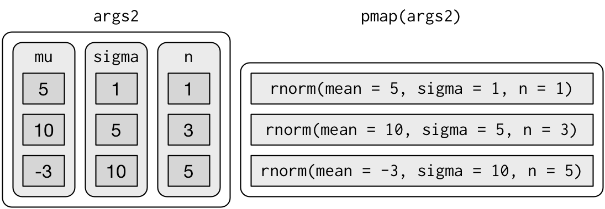
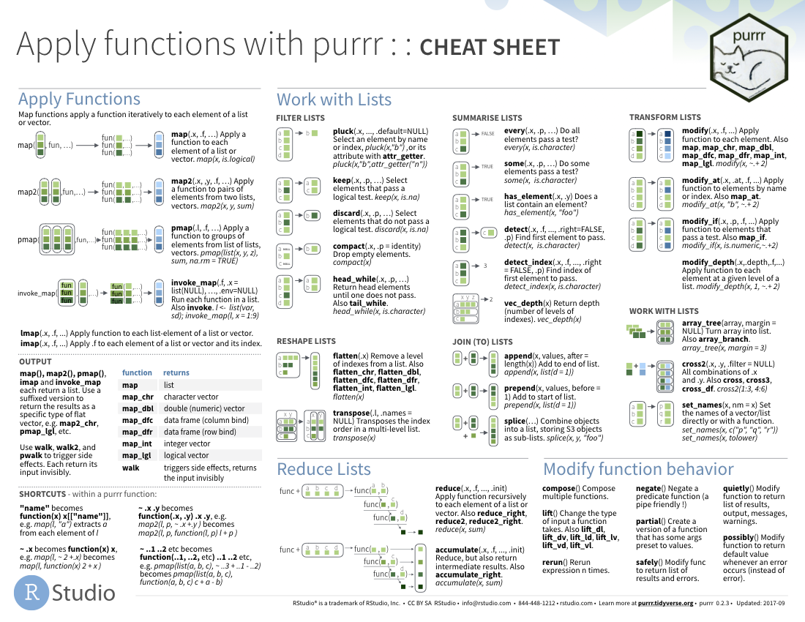

[Back to overview](../index.html)

# Today's Agenda

- Iteration  with `map()` and functional programming (20 min)
- Network distance between GTFS Stops (10 min)
- Intro to R Markdown (20 min)
- R Package Versions (10 min)

# Iterating with `map()` and functional programming

*There was a question about the use of `map` and list-columns -- I have pasted this narrative/code from the first module where we glossed over this. We can spend a bit more time talking about it here, and then demonstrate its use a bit in the next question about network distance with GTFS*

__Acknowledgement:__ This section heavily draws upon Hadley Wickham's (the progenitor of the Tidyverse) book (available for free online), [R for Data Science](https://r4ds.had.co.nz/), including text, pictures, and code directly copied from that book and slightly modified to suit a shorter narrative. Printed copies are available generally wherever you get your books. 

The [`purrr`](https://purrr.tidyverse.org/) package has been around for several years now, but with some recent updates across the tidyverse packages, and my recent introduction via some [datacamp courses](https://learn.datacamp.com/skill-tracks/intermediate-tidyverse-toolbox?version=1), it has become a crucial part of my R programming toolbox that I would like to spend some time on. 

Iteration is a common feature of programming, and one of the main reasons people want to program in the first place -- e.g., 'I want to do this analysis **for each** sub-unit in my analysis framework'. The typical way to accomplish iteration is through loops, with the most common variety being `for` loops. For loops are an easy-to-understand way to iterate through an analysis, but they have at least three main drawbacks: 1) they are slow, and 2) a lot of extra unnecessary code is created, 3) they are not modular -- pieces of for loops have to be manually copy-pasted, rather than referencing a modular function. 

`purrr` allows for the iterative application of functions to data frames. Additionally, it allows for the nesting of data frames - sometimes we will want to isolate pieces of the iterative analysis, and rather than creating a separate data frame for each iteration, we can nest the iterations into one big data frame. 

The best overview of `purrr`'s functionality is in the [Iteration chapter of R for Data Science](https://r4ds.had.co.nz/iteration.html). Some of that chapter is copied here, but it is useful to review the entire chapter for a comprehensive understanding. 

## For loops vs. functionals

For loops are not as important in R as they are in other languages because R is a functional programming language. This means that it's possible to wrap up for loops in a function, and call that function instead of using the for loop directly.

To see why this is important, consider (again) this simple data frame:

```{r}
library(tidyverse)
df <- tibble(
  a = rnorm(10),
  b = rnorm(10),
  c = rnorm(10),
  d = rnorm(10)
)
```

Imagine you want to compute the mean of every column. You could do that with a for loop:

```{r}
output <- vector("double", length(df))
for (i in seq_along(df)) {
  output[[i]] <- mean(df[[i]])
}
output
```

You realise that you're going to want to compute the means of every column pretty frequently, so you extract it out into a function:

```{r}
col_mean <- function(df) {
  output <- vector("double", length(df))
  for (i in seq_along(df)) {
    output[i] <- mean(df[[i]])
  }
  output
}
```

But then you think it'd also be helpful to be able to compute the median, and the standard deviation, so you copy and paste your `col_mean()` function and replace the `mean()` with `median()` and `sd()`:

```{r}
col_median <- function(df) {
  output <- vector("double", length(df))
  for (i in seq_along(df)) {
    output[i] <- median(df[[i]])
  }
  output
}
col_sd <- function(df) {
  output <- vector("double", length(df))
  for (i in seq_along(df)) {
    output[i] <- sd(df[[i]])
  }
  output
}
```

Uh oh! You've copied-and-pasted this code twice, so it's time to think about how to generalise it. Notice that most of this code is for-loop boilerplate and it's hard to see the one thing (`mean()`, `median()`, `sd()`) that is different between the functions.

What would you do if you saw a set of functions like this:

```{r}
f1 <- function(x) abs(x - mean(x)) ^ 1
f2 <- function(x) abs(x - mean(x)) ^ 2
f3 <- function(x) abs(x - mean(x)) ^ 3
```

Hopefully, you'd notice that there's a lot of duplication, and extract it out into an additional argument:

```{r}
f <- function(x, i) abs(x - mean(x)) ^ i
```

You've reduced the chance of bugs (because you now have 1/3 of the original code), and made it easy to generalise to new situations. 

We can do exactly the same thing with `col_mean()`, `col_median()` and `col_sd()` by adding an argument that supplies the function to apply to each column:

```{r}
col_summary <- function(df, fun) {
  out <- vector("double", length(df))
  for (i in seq_along(df)) {
    out[i] <- fun(df[[i]])
  }
  out
}
col_summary(df, median)
col_summary(df, mean)
```

The idea of passing a function to another function is an extremely powerful idea, and it's one of the behaviours that makes R a functional programming language. It might take you a while to wrap your head around the idea, but it's worth the investment. In the rest of the chapter, you'll learn about and use the __purrr__ package, which provides functions that eliminate the need for many common for loops. The apply family of functions in base R (`apply()`, `lapply()`, `tapply()`, etc) solve a similar problem, but purrr is more consistent and thus is easier to learn.

The goal of using purrr functions instead of for loops is to allow you to break common list manipulation challenges into independent pieces: 

1. How can you solve the problem for a single element of the list? Once
   you've solved that problem, purrr takes care of generalising your
   solution to every element in the list.

1. If you're solving a complex problem, how can you break it down into
   bite-sized pieces that allow you to advance one small step towards a 
   solution? With purrr, you get lots of small pieces that you can
   compose together with the pipe.

This structure makes it easier to solve new problems. It also makes it easier to understand your solutions to old problems when you re-read your old code.

## The map functions

The pattern of looping over a vector, doing something to each element and saving the results is so common that the purrr package provides a family of functions to do it for you. There is one function for each type of output:

* `map()`     makes a list.
* `map_lgl()` makes a logical vector.
* `map_int()` makes an integer vector.
* `map_dbl()` makes a double vector.
* `map_chr()` makes a character vector.

Each function takes a vector as input, applies a function to each piece, and then returns a new vector that's the same length (and has the same names) as the input. The type of the vector is determined by the suffix to the map function. 

Once you master these functions, you'll find it takes much less time to solve iteration problems. But you should never feel bad about using a for loop instead of a map function. The map functions are a step up a tower of abstraction, and it can take a long time to get your head around how they work. The important thing is that you solve the problem that you're working on, not write the most concise and elegant code (although that's definitely something you want to strive towards!).

Some people will tell you to avoid for loops because they are slow. They're wrong! (Well at least they're rather out of date, as for loops haven't been slow for many years.) The chief benefits of using functions like `map()` is not speed, but clarity: they make your code easier to write and to read.

We can use these functions to perform the same computations as the last for loop. Those summary functions returned doubles, so we need to use `map_dbl()`:

```{r}
map_dbl(df, mean)
map_dbl(df, median)
map_dbl(df, sd)
```

Compared to using a for loop, focus is on the operation being performed (i.e. `mean()`, `median()`, `sd()`), not the bookkeeping required to loop over every element and store the output. This is even more apparent if we use the pipe:

```{r}
df %>% map_dbl(mean)
df %>% map_dbl(median)
df %>% map_dbl(sd)
```

There are a few differences between `map_*()` and `col_summary()`:

*   All purrr functions are implemented in C. This makes them a little faster
    at the expense of readability.
    
*   The second argument, `.f`, the function to apply, can be a formula, a 
    character vector, or an integer vector. You'll learn about those handy 
    shortcuts in the next section.
    
*   `map_*()` uses ... ([dot dot dot]) to pass along additional arguments 
    to `.f` each time it's called:

    ```{r}
    map_dbl(df, mean, trim = 0.5)
    ```

*   The map functions also preserve names:

    ```{r}
    z <- list(x = 1:3, y = 4:5)
    map_int(z, length)
    ```

## Shortcuts

There are a few shortcuts that you can use with `.f` in order to save a little typing. Imagine you want to fit a linear model to each group in a dataset. The following toy example splits up the `mtcars` dataset into three pieces (one for each value of cylinder) and fits the same linear model to each piece:  

```{r}
models <- mtcars %>% 
  split(.$cyl) %>% 
  map(function(df) lm(mpg ~ wt, data = df))
```

The syntax for creating an anonymous function in R is quite verbose so purrr provides a convenient shortcut: a one-sided formula.

```{r}
models <- mtcars %>% 
  split(.$cyl) %>% 
  map(~lm(mpg ~ wt, data = .))
```

Here I've used `.` as a pronoun: it refers to the current list element (in the same way that `i` referred to the current index in the for loop). 

When you're looking at many models, you might want to extract a summary statistic like the $R^2$. To do that we need to first run `summary()` and then extract the component called `r.squared`. We could do that using the shorthand for anonymous functions:

```{r}
models %>% 
  map(summary) %>% 
  map_dbl(~.$r.squared)
```

But extracting named components is a common operation, so purrr provides an even shorter shortcut: you can use a string.

```{r}
models %>% 
  map(summary) %>% 
  map_dbl("r.squared")
```

You can also use an integer to select elements by position: 

```{r}
x <- list(list(1, 2, 3), list(4, 5, 6), list(7, 8, 9))
x %>% map_dbl(2)
```

## The map functions

The pattern of looping over a vector, doing something to each element and saving the results is so common that the purrr package provides a family of functions to do it for you. There is one function for each type of output:

* `map()`     makes a list.
* `map_lgl()` makes a logical vector.
* `map_int()` makes an integer vector.
* `map_dbl()` makes a double vector.
* `map_chr()` makes a character vector.

Each function takes a vector as input, applies a function to each piece, and then returns a new vector that's the same length (and has the same names) as the input. The type of the vector is determined by the suffix to the map function. 

Once you master these functions, you'll find it takes much less time to solve iteration problems. But you should never feel bad about using a for loop instead of a map function. The map functions are a step up a tower of abstraction, and it can take a long time to get your head around how they work. The important thing is that you solve the problem that you're working on, not write the most concise and elegant code (although that's definitely something you want to strive towards!).

Some people will tell you to avoid for loops because they are slow. They're wrong! (Well at least they're rather out of date, as for loops haven't been slow for many years.) The chief benefits of using functions like `map()` is not speed, but clarity: they make your code easier to write and to read.

We can use these functions to perform the same computations as the last for loop. Those summary functions returned doubles, so we need to use `map_dbl()`:

```{r}
map_dbl(df, mean)
map_dbl(df, median)
map_dbl(df, sd)
```

Compared to using a for loop, focus is on the operation being performed (i.e. `mean()`, `median()`, `sd()`), not the bookkeeping required to loop over every element and store the output. This is even more apparent if we use the pipe:

```{r}
df %>% map_dbl(mean)
df %>% map_dbl(median)
df %>% map_dbl(sd)
```

There are a few differences between `map_*()` and `col_summary()`:

*   All purrr functions are implemented in C. This makes them a little faster
    at the expense of readability.
    
*   The second argument, `.f`, the function to apply, can be a formula, a 
    character vector, or an integer vector. You'll learn about those handy 
    shortcuts in the next section.
    
*   `map_*()` uses ... ([dot dot dot]) to pass along additional arguments 
    to `.f` each time it's called:

    ```{r}
    map_dbl(df, mean, trim = 0.5)
    ```

*   The map functions also preserve names:

    ```{r}
    z <- list(x = 1:3, y = 4:5)
    map_int(z, length)
    ```

## Mapping over multiple arguments

So far we've mapped along a single input. But often you have multiple related inputs that you need iterate along in parallel. That's the job of the `map2()` and `pmap()` functions. For example, imagine you want to simulate some random normals with different means. You know how to do that with `map()`:

```{r}
mu <- list(5, 10, -3)
mu %>% 
  map(rnorm, n = 5) %>% 
  str()
```

What if you also want to vary the standard deviation? One way to do that would be to iterate over the indices and index into vectors of means and sds:

```{r}
sigma <- list(1, 5, 10)
seq_along(mu) %>% 
  map(~rnorm(5, mu[[.]], sigma[[.]])) %>% 
  str()
```

But that obfuscates the intent of the code. Instead we could use `map2()` which iterates over two vectors in parallel:

```{r}
map2(mu, sigma, rnorm, n = 5) %>% str()
```

`map2()` generates this series of function calls:

```{r, echo = FALSE}
knitr::include_graphics("graphics/diagrams/lists-map2.png")
```

Note that the arguments that vary for each call come _before_ the function; arguments that are the same for every call come _after_.

Like `map()`, `map2()` is just a wrapper around a for loop:

```{r}
map2 <- function(x, y, f, ...) {
  out <- vector("list", length(x))
  for (i in seq_along(x)) {
    out[[i]] <- f(x[[i]], y[[i]], ...)
  }
  out
}
```

You could also imagine `map3()`, `map4()`, `map5()`, `map6()` etc, but that would get tedious quickly. Instead, purrr provides `pmap()` which takes a list of arguments. You might use that if you wanted to vary the mean, standard deviation, and number of samples:

```{r}
n <- list(1, 3, 5)
args1 <- list(n, mu, sigma)
args1 %>%
  pmap(rnorm) %>% 
  str()
```

That looks like:

```{r, echo = FALSE}
knitr::include_graphics("graphics/diagrams/lists-pmap-unnamed.png")
```

If you don't name the list's elements, `pmap()` will use positional matching when calling the function. That's a little fragile, and makes the code harder to read, so it's better to name the arguments:

```{r, eval = FALSE}
args2 <- list(mean = mu, sd = sigma, n = n)
args2 %>% 
  pmap(rnorm) %>% 
  str()
```

That generates longer, but safer, calls:

```{r, echo = FALSE}

```

Since the arguments are all the same length, it makes sense to store them in a data frame:

```{r}
params <- tribble(
  ~mean, ~sd, ~n,
    5,     1,  1,
   10,     5,  3,
   -3,    10,  5
)
params %>% 
  pmap(rnorm)
```

As soon as your code gets complicated, I think a data frame is a good approach because it ensures that each column has a name and is the same length as all the other columns.

## Cheat Sheet

As with the other sections, `purrr` has a great cheat sheet to help you remember the main uses of the package. 

[](https://github.com/rstudio/cheatsheets/raw/master/purrr.pdf)

# Network Distance between GTFS Stops

We're going to compare two methods for calculating network distance between bus stops: 1) based on the bus route geometry using the `shape_dist_traveled` field in the `stop_times` table of GTFS and 2) using walking directions provided by the Mapbox API. This will also give us some nice opportunities to test out our `map`ing skills!

For more info on using the Mapbox API, check out the [vignette for this webinar](http://walker-data.com/MUSAmasterclass/tutorial/) that was done by Kyle Walker very recently, complete with plenty of example code and narrative. The video will be linked there soon.  

```{r,include=FALSE}
library(tidyverse)
library(tidytransit)
library(sf)
library(mapboxapi)
library(leaflet)
my_token <- "pk.eyJ1IjoiYmJsYW5jIiwiYSI6ImNrZzgycXE2MzBkOWEycm8yN2M2NmZvaXAifQ.B8wfvRQ5VujdLqr7Y6WNgw"
mb_access_token(my_token)
```


```{r, warning=FALSE, message=FALSE}

trimet_gtfs = read_gtfs('data/trimet_gtfs.zip')

tm_routes = trimet_gtfs$routes
tm_stop_times = trimet_gtfs$stop_times
tm_trips = trimet_gtfs$trips
tm_stops = trimet_gtfs$stops

head(tm_routes)
#We're going to test with route 4, direction 0 (northbound/outbound)
sub_trips = tm_trips %>%
  filter(route_id==4,direction_id==0)
sub_stop_times = tm_stop_times %>%
  filter(trip_id %in% sub_trips$trip_id) %>%
  left_join(sub_trips)
sub_stop_orders = sub_stop_times %>%
  distinct(shape_id,stop_sequence,stop_id,timepoint,shape_dist_traveled) %>%
  arrange(shape_id,stop_sequence)

#Using Mapbox API for directions -----------

#This will take 30 seconds or so to run
sub_stop_ods = sub_stop_orders %>%
  group_by(shape_id) %>%
  mutate(from_stop_id = lag(stop_id),to_stop_id = stop_id) %>%
  filter(!is.na(from_stop_id)) %>%
  ungroup() %>%
  select(from_stop_id,to_stop_id) %>%
  distinct() %>%
  left_join(tm_stops %>%
              select(stop_id,stop_name,stop_lon,stop_lat) %>%
              rename(from_stop_id = stop_id,
                     from_stop_name = stop_name,
                     from_stop_lon = stop_lon,
                     from_stop_lat = stop_lat)) %>%
  left_join(tm_stops %>%
              select(stop_id,stop_name,stop_lon,stop_lat) %>%
              rename(to_stop_id = stop_id,
                     to_stop_name = stop_name,
                     to_stop_lon = stop_lon,
                     to_stop_lat = stop_lat)) %>%
  mutate(origin = paste0(from_stop_lon,', ',from_stop_lat),
         destination = paste0(to_stop_lon,', ',to_stop_lat)) %>%
  mutate(dir_results = pmap(.l = list(origin,destination),
                            .f = ~mb_directions(origin = ..1,
                                           destination = ..2,
                                           profile = 'walking')))

network_distances_directions = sub_stop_ods %>% 
  mutate(walk_distance_mi = map_dbl(dir_results,~as.numeric(.x$distance)*0.621371)) %>%
  select(-dir_results)

# Using the distances from the stop times file
network_dist_compare = network_distances_directions %>%
  mutate(bus_distance_mi = map2_dbl(from_stop_id,to_stop_id,function(from_stop_id,to_stop_id){
    
    q_stop_orders = sub_stop_orders %>%
      filter(stop_id %in% c(from_stop_id,to_stop_id)) %>%
      arrange(stop_sequence) %>%
      group_by(shape_id) %>%
      summarise(dist_traveled_mi = (max(shape_dist_traveled) - min(shape_dist_traveled))/5280) %>%
      filter(dist_traveled_mi>0)
    
    return(mean(q_stop_orders$dist_traveled_mi))
  })) %>%
  mutate(extra_walk_distance = walk_distance_mi - bus_distance_mi)

network_dist_pf = network_dist_compare %>%
  mutate(stop_pair_id = paste0(from_stop_id,'-',to_stop_id)) %>%
  select(stop_pair_id,bus_distance_mi,walk_distance_mi,extra_walk_distance) %>%
  pivot_longer(c(bus_distance_mi,walk_distance_mi,extra_walk_distance)) %>%
  mutate(plot_label = case_when(
    name=='bus_distance_mi'~'Bus Travel Distance (mi)',
    name=='walk_distance_mi'~'Walk Network Distance(mi)',
    name=='extra_walk_distance'~'Additional Walking Distance (mi)'
  ))

ggplot(network_dist_pf,aes(x=value,fill=plot_label))+
  geom_histogram(show.legend = FALSE)+
  ylab('# of Stop Pairs')+xlab('Distance (mi)')+
  facet_wrap(~plot_label,ncol=1)

#Mapping these pairsm along with shapes
sub_shapes = trimet_gtfs$shapes %>%
  filter(shape_id %in% sub_trips$shape_id)

head(sub_shapes)

sub_shapes_geom = sub_shapes %>%
  nest(shape_data = c(shape_pt_sequence,shape_dist_traveled,shape_pt_lon,shape_pt_lat)) %>%
  mutate(geometry = map(shape_data,~st_linestring(.x %>% select(shape_pt_lon,shape_pt_lat) %>%
                                                    as.matrix()))) %>%
  mutate(geometry = st_sfc(geometry,crs=4326)) %>%
  st_as_sf()

sub_stops = tm_stops %>%
  filter(stop_id %in% sub_stop_orders$stop_id) %>%
  st_as_sf(coords = c('stop_lon','stop_lat'),crs=4326)

walking_dir_shapes = sub_stop_ods %>%
  select(from_stop_id,from_stop_name,
         to_stop_id,to_stop_name,dir_results) %>%
  unnest(dir_results) %>%
  mutate(geometry = st_sfc(geometry,crs=4326)) %>%
  st_as_sf() %>%
  mutate(pair_label = paste0('FROM ',from_stop_name,' TO ',to_stop_name))

leaflet() %>%
  addProviderTiles('CartoDB.Positron') %>%
  addPolylines(data = sub_shapes_geom,color='blue',weight=3,opacity = 1,
               label=~shape_id,group=~shape_id) %>%
  addPolylines(data = walking_dir_shapes,color='red',weight=4,opacity = 0.5,
               label=~pair_label) %>%
  addMarkers(data = sub_stops,label=~stop_name) %>%
  addLayersControl(baseGroups = unique(sub_shapes_geom$shape_id)) %>%
  addMeasure(primaryLengthUnit = 'miles')
  

```

# Intro to R Markdown

Bryan will talk about R Markdown, which was used to develop this course, and show the markdown for this module as an example. We will also refer to the introduction lessons developed by RStudio [here](https://rmarkdown.rstudio.com/lesson-1.html)

# R Package Versioning

Making the most use of R requires relying on packages, which occasionally go through major or minor updates. Like R itself, package versions are numbered in the format `major.minor.patch`. Though not every package developer is sure to follow this framework, this convention was established several years ago to get developers on the same page:

- Increment `patch`, e.g. 0.8.2 for a patch: you’ve fixed bugs without adding any significant new features. I’ll often do a patch release if, after release, I discover a show-stopping bug that needs to be fixed ASAP. Most releases will have a patch number of 0.
- Increment `minor`, e.g. 0.9.0, for a minor release. A minor release can include bug fixes, new features and changes in backward compatibility. This is the most common type of release. It’s perfectly fine to have so many minor releases that you need to use two (or even three!) digits, e.g. 1.17.0.
- Increment `major`, e.g. 1.0.0, for a major release. This is best reserved for changes that are not backward compatible and that are likely to affect many users. Going from 0.b.c to 1.0.0 typically indicates that your package is feature complete with a stable API.

All this is to say that typically a package will be backward compatible with old code *except for* when there is a `major` upgrade. Most developers, including those of packages produced by RStudio (e.g., `tidyverse`), will maintain backward compatibility for some period of time before completely cutting it off -- this is called 'deprecation' and will be accompanied by a warning. For example, the `gather()` and `spread()` functions have been deprecated in favor of `pivot_longer()` and `pivot_wider()` -- the old functions still work, but at some point in the future, to reduce complexity in the package code, these functions will be removed. 

Many R packages will include a **changelog** -- these are good to review for packages you use often, so you know what new features have been added and if any major implementation changes have been made. Here is an [example for `dplyr`](https://dplyr.tidyverse.org/news/index.html) and here is an [example for `tidyr`](https://tidyr.tidyverse.org/news/index.html). . These typically can be found in the GitHub repository for a package and/or a package's website. 

Sometimes you will get a message that says 'this package was built under R version 4.x.x' that is ahead of your current R version. This is generally just a warning and whether it breaks something depends upon the package in question. It is a good idea to be on at least the major version upgrade of R that is current --i.e. you should be on at least R version 4.0.0. We are going to work on establishing an update cycle for R users at Nelson\\Nygaard that keeps people on the same version of R. There shouldn't be a need to upgrade more often than every six months or so, depending on how that aligns with major updates. Given that R was just upgraded to version 4 earlier this year, I would not expect a major upgrade again for a few years. To quickly see what version of R you have, use the `R.Version()` function. 

```{r}
R.Version()
```

## `packrat`

For production code projects, where a client will be continuously re-using code you have constructed (e.g., in a Shiny app or in an R project sent to a client), it can make sense to use [`Packrat`](https://rstudio.github.io/packrat/), which sets up an individual package library for each R project. This probably doesn't make sense for every project -- if you're just writing a short one-off script, it is probably not worth taking up the room on your computer of individual package libraries per project. 

## Further Reading

- http://rstudio-pubs-static.s3.amazonaws.com/275466_5b148ae941254114ab0620c2fd6be4fb.html
- https://www.littlemissdata.com/blog/r-package-install
- For production code projects (like )

# Reference Materials

## Cheat Sheets

- [Apply functions with purrr](https://github.com/rstudio/cheatsheets/raw/master/purrr.pdf)

## Further Reading 

- [R for Data Science](https://r4ds.had.co.nz/), by Garrett Grolemund and Hadley Wickham. As mentioned above, some of the content for this module is copied directly from that book. 

## Related DataCamp Courses

- [Intermediate Tidyverse Toolbox course track (4 courses, 16 hours)](https://learn.datacamp.com/skill-tracks/intermediate-tidyverse-toolbox?version=1)

*This content was presented to Nelson\\Nygaard Staff at a Lunch and Learn webinar on Tuesday, October 13th, and is [available as a recording here](TODO) and embedded at the top of the page.*

